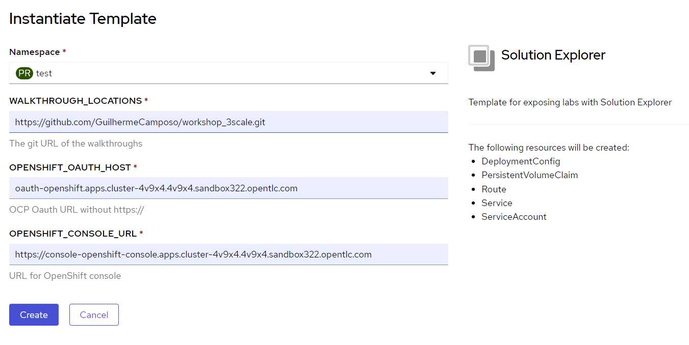

= Workshop Enablement Camel

== Installing the Solution Explorer

1. Install the template

----
oc create -f openshift/template.yml
----

2. Use the console to deploy the template

3. Enable OpenShift Authentication

----
ROUTE=$(oc get route solution-explorer -o jsonpath='{.spec.host}')

# you have to be in the same namespace where you deployed the app
cat openshift/oauth-client.yml | sed "s/WALKTHROUGH_ROUTE/$ROUTE/g" | oc create -f -
----
