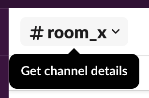
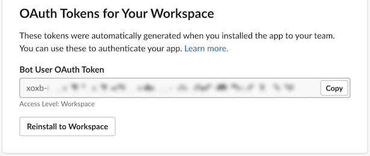

:toc:
:toc-placement!:

toc::[]

== Gitter's platform onboarding

=== Join a Slack workspace.

To accelerate the onboarding process in Slack, we've created a public workspace for anyone to freely join and use for the purpose of this enablement workshop. 

Follow the invite link to join the workshop's workspace in Slack:

* https://join.slack.com/t/camelworkshop/shared_invite/zt-1fvfhatch-HQKSJyob_YIY3nRGhJ7tWA

CAUTION: The workspace is open to the public, please be mindful of your actions, don't abuse the space.

NOTE: if you were unsuccessful joining the public workspace provided, feel free to create you own Slack workspace, you should be able to complete the workshop in the same manner.

{empty} +

=== Join a Slack room (channel).
. A number of public rooms were made available in the public workspace for the workshop (room1, room2, ...roomX). Choose a room number that nobody uses to avoid noisy conversations.
+
Alternatively, you can also create your own room, use the prefix `room_`, for example:

* `room_x`

{empty} +

=== Connecting Camel to Slack

To connect from Camel to the chat platform, an App needs to be registered in Slack. You would just need to add the registered App to a particular room to allow Camel to pick up messages.

* If you are running the workshop on your own, you'll have to create an App in Slack. Click the link below to follow instructions on how to create your own App.

** link:#creating-your-own-app-for-slack[Creating your own App for Slack]

* If you're part of a workshop group, an App has been made available for all students to share. Proceed with the instructions that follow to add the shared App to your selected room.

{empty} +

==== [[adding-an-app-to-a-room]]Adding an App to a room

Once you have an App available, follow the steps below:

. Join a Slack room (channel)
+
A number of public rooms were made available for this workshop (roomX). Choose a room number that nobody uses to avoid noisy conversations.
+
You can also create your own room, use the prefix `room_`, for example:

* `room_x`

. Open the channel details of the room you joined
+

. Click on the `Integrations` tab, and add an App
+

. Find the `CamelWorkshopApp` (or your own app), and click `Add`
+
image::images/slack-add-app-to-room.png[align="left", width=60%]

Your room has now the App included. Camel can use the App credentials to communicate with Slack.

If you are sharing the App with a group, ask your workshop's admin for the App credentials to configure Camel.

{empty} +

==== Return to the main walkthrough guide

You are now ready to complete your integration definition. +
Click the link below to jump back to the main guide walktrough:

* Continue defining your Stage 1 integration flow as:
** link:walkthrough.adoc#step8[The Kubernetes user]
** link:walkthrough.adoc#step8[The Camel developer]

{empty} +
{empty} +

==== [[creating-your-own-app-for-slack]] Creating your own App for Slack

. Connect to the following URL
+
* https://api.slack.com/apps

. Click on the `Create New App` button
+

+
Select `From scratch`, then
+
.. Give it a name, for example `MyCamelApp`.
.. Select `CamelWorkshop` (or your own workspace if you created one)
.. Click `Create App`
+
Once the App created you'll be presented with its `Basic Information`

. Select from the left menu:
+

* Features => OAuth & Permissions

+
.. Add scopes
+
Scroll down the screen to find the section `Scopes`. +
Include the following Bot scopes:
+
--
- channels:history
- channels:read
- chat:write
- mpim:history
--
+
.. Generate tokens
+
Scroll up until you find `OAuth Tokens for Your Workspace`. +
Click `Install in Workspace`.
+
You will be requested permissions to access the workspace, click `Allow`.
+
Slack then generates and presents the Oauth token for your App:
+

{empty} +

Once your App is created, you're ready to add it to your workspace room (or channel). +
Click the link below to jump (scroll up) to the section with instructions on how to add your app:

* link:#adding-an-app-to-a-room[Adding an App to a room]

{empty} +

