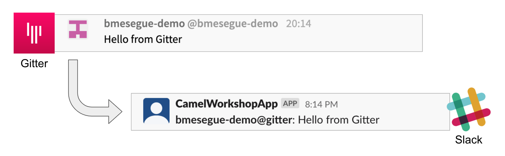

=== [[camel-developer]] The Camel user development flow

The tool that will help us to test locally is *Camel JBang*.

TIP: Camel JBang is an upstream tool for Camel. It is not supported yet by Red Hat but it is an extremely useful tool for all things Camel. It simplifies many of the common tasks with Camel. 

. To start with, we will simply consume Gitter messages and log them. We select the following 2 Kamelets to bind:
+
--
- gitter-source
- log-sink
--
+
Create a YAML file `g2s.yaml` (gitter to slack) containing the following definition:
+
```yaml
apiVersion: camel.apache.org/v1alpha1
kind: KameletBinding
metadata:
  name: g2s
spec:

  source:
    ref:
      kind: Kamelet
      apiVersion: camel.apache.org/v1
      name: gitter-source
    properties:
      token: "{{gitter.token}}"
      room:  "{{gitter.room}}"

  sink:
    ref:
      kind: Kamelet
      apiVersion: camel.apache.org/v1
      name: log-sink 
```
+
Now create the properties file `stage1.properties` containing the following entries:
+
```properties
# Allows HTTP streaming from Gitter
camel.main.streamCachingEnabled=false

# On shutdown it reduces waiting time when stoping Camel's streaming listener
camel.main.shutdownTimeout = 5

# Gitter credentials
gitter.token=YOUR_ACCESS_TOKEN
gitter.room=YOUR_ROOM_ID
```
+
NOTE: The `gitter-source` kamelet is implemented following the specification of Gitter's Streaming API to consume events from the server. To know more, read more its API documentation here: https://developer.gitter.im/docs/streaming-api
+
IMPORTANT: You will notice the presence of the property `streamCachingEnabled` that requires to be disabled. This allows Camel to process the input as an continuous input stream.
+
{empty} +

. Run your YAML definition with Camel JBang
+ 
Use the following command to run locally your Kamelet Binding:
+
```bash
camel run g2s.yaml \
--local-kamelet-dir=$PWD/../kamelets \
--properties=stage1.properties
```
+
Camel JBang will build a local runnable and start Camel. +
In the output logs you should see Camel connecting to Gitter, similar to the following:
+
----
... : Apache Camel 3.18.0 (CamelJBang) started in 2s124ms (build:170ms init:1s738ms start:216ms JVM-uptime:4s)
... : Opening connection to Gitter...
... : Gitter HTTP Streaming started
----
+
Now, from Gitter's chat room, send a message, for example "Hello Camel". +
Your terminal should show the arrival of a Gitter event similar to the following JSON payload:
+
```json
{"id":"6318848405ad4a3701dccfb4","text":"Hello Camel","html":"Hello Camel","sent":"2022-09-07T11:46:12.825Z","readBy":0,"urls":[],"mentions":[],"issues":[],"meta":[],"v":1,"fromUser":{"id":"xxxxxxxxxxxxxxxx","username":"demo-user"         }}
```
+
Hopefully you've been successful in capturing Gitter messages with Camel. +
Press `Ctrl`+`C` to stop Camel.
+
{empty} +

. Now we need extend the Kamelet Binding definition to include data transformation to match the JSON structure the target system (Slack) expects.
+
We choose from the Kamelet Catalog the JSLT action to transform the body.
+
TIP: JSLT is a very convenient transformer to manipulate JSON payloads. It's inspired in XSLT (XML Transformation) to define stylesheets containing transformation rules for JSON.
+
Create the JSLT file `g2s.jslt` containing the following definition:
+
```json
{
    "channel":"TO_BE_DEFINED",
    "text":"*"+.fromUser.username+"@gitter*: "+.text
}
```
+
[NOTE]
====
* The field `channel` denotes the target room in Slack where messages will be pushed. For now we use a temporary value. +
* The field `text` includes JsonPath rules extracting values from the input Gitter event.
====
{empty} +

. Modify your YAML definition to include the JSLT action between your Kamelet source and sink.
+
The resulting YAML file should look as follows (you can copy the middle snippet into your code):
+
----
apiVersion: camel.apache.org/v1alpha1
kind: KameletBinding
metadata:
  name: g2s
spec:

  source:
    ref:
      kind: Kamelet
      apiVersion: camel.apache.org/v1
      name: gitter-source
    properties:
      token: "{{gitter.token}}"
      room:  "{{gitter.room}}"
----
+
```yaml
  steps:
  - ref:
      kind: Kamelet
      apiVersion: camel.apache.org/v1
      name: jslt-action
    properties:
      template: g2s.jslt
```
+
----
  sink:
    ref:
      kind: Kamelet
      apiVersion: camel.apache.org/v1
      name: log-sink 
----
{empty} +


. Run Camel JBang again ensuring you include your JSLT file. It should look as follows:
+
```bash
camel run g2s.yaml g2s.jslt \
--local-kamelet-dir=$PWD/../kamelets \
--properties=stage1.properties
```
{empty} +

. From Gitter send another chat message and inspect your terminal output. You should see an incoming event now transformed and looking similar to this:
+
```json
{"channel":"TO_BE_DEFINED","text":"*demo-user@gitter*: Hello Camel"}
```
+
At this stage you're ready to replace the Log sink Kamelet by the real one, the Slack sink Kamelet.
+
{empty} +

. If you're not done so yet, onboard onto the Slack chat platform
+
Please follow the link below to complete the Slack onboarding process.
+
* link:onboarding-slack.adoc[Slack's platform onboarding]
+
{empty} +

. [[step-slack-sink]]Replace your Log sink Kamelet by the Slack one.
+
Copy from below the `slack-sink` definition, and replace your old `log-sink` code.
+
----
apiVersion: camel.apache.org/v1alpha1
kind: KameletBinding
metadata:
  name: g2s
spec:

  source:
    ref:
      kind: Kamelet
      apiVersion: camel.apache.org/v1
      name: gitter-source
    properties:
      token: "{{gitter.token}}"
      room:  "{{gitter.room}}"

  steps:
  - ref:
      kind: Kamelet
      apiVersion: camel.apache.org/v1
      name: jslt-action
    properties:
      template: g2s.jslt
----
+
```yaml
  sink:
    ref:
      kind: Kamelet
      apiVersion: camel.apache.org/v1
      name: slack-sink
    properties:
      token: "{{slack.token}}"
```
+
{empty} +

. Configure your target Slack `channel`
+
Previously we defined a dummy value in our JSLT transformation (where the `channel` field is defined). Now we need to replace the dummy value with the real one.
+
.. Open in Slack the room details
+
image::images/slack-room-details.png[align="left", width=20%]
+
.. Copy the Channel ID at the bottom of the details frame
+

+
.. Paste its value in your JSLT mapping. It should you similar to the following:
+
```
{
    "channel":"C041XMH9M41",
    "text":"*"+.fromUser.username+"@gitter*: "+.text
}
```
Slack will read the `channel` field (target room), from the JSON payload we send, to know where to place the message. +
+
{empty} +

. Include your Slack token in your configuration file.
+
Copy from below the parameter definition `slack.token`, paste it into your properties file, and configure its value with your Slack access token value.
+
----
# Allows HTTP streaming from Gitter
camel.main.streamCachingEnabled=false

# On shutdown it reduces waiting time when stoping Camel's streaming listener
camel.main.shutdownTimeout = 5

# Gitter credentials
gitter.token=2d482bdf092e0e2299832b1f38d9560243083894
gitter.room=6317569e6da03739849c519a
----
+
```properties
# Slack credentials
slack.token=YOUR_TOKEN
```
+
* If you're sharing an App with the group, use the App's token your admin has provided.
* If you created your own App, use your App's `Bot User OAuth Token`
+
{empty} +

. Run Camel JBang from your terminal as follows:
+
```bash
camel run g2s.yaml g2s.jslt \
--local-kamelet-dir=$PWD/../kamelets \
--properties=stage1.properties
```
{empty} +

. One more time, from Gitter send one last message. If all goes well you should see the message listed in your Slack chat window
+

+
{empty} +