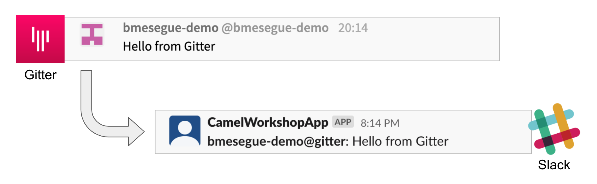

= [[kubernetes-user]] The Kubernetes user deployment flow

The instructions below will make you progress one Camel step at a time rather than providing a complete _Kamelet Binding_ of the full data flow. This will allow you to play with different _Kamelets_ and understand better the mechanics of _Kamelet Bindings_.

. Create the definitions
.. To start with, we will simply consume Gitter messages and log them. We select the following 2 Kamelets to bind:
+
--
- gitter-source
- log-sink
--
+
Create a YAML file `g2s.yaml` (gitter to slack) containing the following definition:
+
```yaml
apiVersion: camel.apache.org/v1alpha1
kind: KameletBinding
metadata:
  name: g2s
spec:
  integration:
    configuration:
     - type: "secret"
       value: "stage1"
     - type: "configmap"
       value: "stage1-transform"

  source:
    ref:
      kind: Kamelet
      apiVersion: camel.apache.org/v1
      name: gitter-source
    properties:
      token: "{{secret:stage1/gitter.token}}"
      room:  "{{secret:stage1/gitter.room}}"

  sink:
    ref:
      kind: Kamelet
      apiVersion: camel.apache.org/v1
      name: log-sink 
```
+
.. Now create the properties file `stage1.properties` containing the following entries:
+
```properties
# Allows HTTP streaming from Gitter
camel.main.streamCachingEnabled=false

# Gitter credentials
gitter.token=YOUR_ACCESS_TOKEN
gitter.room=YOUR_ROOM_ID
```
+
NOTE: The `gitter-source` kamelet is implemented following the specification of Gitter's Streaming API to consume events from the server. To know more, read more its API documentation here: https://developer.gitter.im/docs/streaming-api
+
IMPORTANT: You will notice the presence of the property `streamCachingEnabled` that requires to be disabled. This allows Camel to process the input as an continuous input stream.
+
{empty} +

. Push the configuration to _OpenShift_
+
Ensure you select your target _OpenShift_ working project, for example by running:
+
```bash
oc create project demo-camelk

```
+
Then create a _Secret_ containing your configuration. Run the following `oc` command:
+
```bash
oc create secret generic stage1 --from-env-file=stage1.properties

```
{empty} +

. Deploy your YAML definition containing your Kamelet Binding
.. Run the following `oc` command to deploy the integration:
+
```bash
oc apply -f g2s.yaml
```
+
The Camel K operator will immediately react. It will start building the integration and deploy it.
+
NOTE: Be patient, this action will take some time to complete as the operator needs to download all the maven dependencies, build the application and create the image before the integration can be deployed.

.. Check the logs.
+
When the operator deploys the integration, you will be able to inspect the logs from the running pod to check all looks normal. You should see Camel connecting to Gitter and starting the streaming listener:
+
----
... : Apache Camel 3.18.0 (CamelJBang) started in 2s124ms (build:170ms init:1s738ms start:216ms JVM-uptime:4s)
... : Opening connection to Gitter...
... : Gitter HTTP Streaming started
----
+
{empty} +

. Send a message from Gitter
+
Now, from Gitter's chat room, send a message, for example "Hello Camel". +
The logs in your pod should show the arrival of a Gitter event similar to the following JSON payload:
+
```json
{"id":"6318848405ad4a3701dccfb4","text":"Hello Camel","html":"Hello Camel","sent":"2022-09-07T11:46:12.825Z","readBy":0,"urls":[],"mentions":[],"issues":[],"meta":[],"v":1,"fromUser":{"id":"xxxxxxxxxxxxxxxx","username":"demo-user"         }}
```
+
Hopefully you've been successful in capturing Gitter messages with Camel. +
+
{empty} +

. Now we need extend the Kamelet Binding definition to include data transformation to match the JSON structure the target system (Slack) expects.
+
We choose from the Kamelet Catalog the JSLT action to transform the body.
+
TIP: JSLT is a very convenient transformer to manipulate JSON payloads. It's inspired in XSLT (XML Transformation) to define stylesheets containing transformation rules for JSON.
+
.. Create the JSLT file `g2s.jslt` containing the following definition:
+
----
{
    "channel":"TO_BE_DEFINED",
    "text":"*"+.fromUser.username+"@gitter*: "+.text
}
----
+
[NOTE]
====
* The field `channel` denotes the target room in Slack where messages will be pushed. For now we use a temporary value. +
* The field `text` includes JsonPath rules extracting values from the input Gitter event.
====
{empty} +

.. Now, let's push the JSLT transformation as a _ConfigMap_ resource the Kamelet Binding will use.
+
Run the following `oc` command:
+
```bash
oc create cm stage1-transform --from-file=g2s.jslt
```
{empty} +

. Modify your YAML definition to include the JSLT action between your Kamelet source and sink.
+
The resulting YAML file should look as follows (you can copy the middle snippet into your code):
+
----
apiVersion: camel.apache.org/v1alpha1
kind: KameletBinding
metadata:
  name: g2s
spec:
  integration:
    configuration:
     - type: "secret"
       value: "stage1"
     - type: "configmap"
       value: "stage1-transform"

  source:
    ref:
      kind: Kamelet
      apiVersion: camel.apache.org/v1
      name: gitter-source
    properties:
      token: "{{secret:stage1/gitter.token}}"
      room:  "{{secret:stage1/gitter.room}}"
----
+
```yaml
  steps:
  - ref:
      kind: Kamelet
      apiVersion: camel.apache.org/v1
      name: jslt-action
    properties:
      template: g2s.jslt
```
+
----
  sink:
    ref:
      kind: Kamelet
      apiVersion: camel.apache.org/v1
      name: log-sink 
----
+
{empty} +


. Redeploy your YAML definition by running again:
+
```bash
oc apply -f g2s.yaml
```
+
The Camel K operator needs again to download dependencies (JSLT), but after some time it will replace the pod with a new instance containing the data transformation.
+
{empty} +

. From Gitter send another chat message and inspect your terminal output. You should see an incoming event now transformed and looking similar to this:
+
```json
{"channel":"TO_BE_DEFINED","text":"*demo-user@gitter*: Hello Camel"}
```
+
At this stage you're ready to replace the Log sink Kamelet by the real one, the Slack sink Kamelet.
+
{empty} +

. If you're not done so yet, onboard onto the Slack chat platform
+
Please follow the link below to complete the Slack onboarding process.
+
* link:onboarding-slack.adoc[Slack's platform onboarding]
+
{empty} +

. [[step-slack-sink]]Replace your Log sink Kamelet by the Slack one.
+
Copy from below the `slack-sink` definition, and replace your old `log-sink` code.
+
----
apiVersion: camel.apache.org/v1alpha1
kind: KameletBinding
metadata:
  name: g2s
spec:
  integration:
    configuration:
     - type: "secret"
       value: "stage1"
     - type: "configmap"
       value: "stage1-transform"

  source:
    ref:
      kind: Kamelet
      apiVersion: camel.apache.org/v1
      name: gitter-source
    properties:
      token: "{{secret:stage1/gitter.token}}"
      room:  "{{secret:stage1/gitter.room}}"

  steps:
  - ref:
      kind: Kamelet
      apiVersion: camel.apache.org/v1
      name: jslt-action
    properties:
      template: g2s.jslt
----
+
```yaml
  sink:
    ref:
      kind: Kamelet
      apiVersion: camel.apache.org/v1
      name: slack-sink
    properties:
      token: "{{slack.token}}"
```
+
{empty} +

. Configure your target Slack `channel`
+
Previously we defined a dummy value in our JSLT transformation (where the `channel` field is defined). Now we need to replace the dummy value with the real one.
+
.. Open in Slack the room details
+
image::images/slack-room-details.png[align="left", width=20%]
+
.. Copy the Channel ID at the bottom of the details frame
+

+
.. Paste its value in your JSLT mapping. It should you similar to the following:
+
```
{
    "channel":"C041XMH9M41",
    "text":"*"+.fromUser.username+"@gitter*: "+.text
}
```
Slack will read the `channel` field (target room), from the JSON payload we send, to know where to place the message. +
+
{empty} +
.. Update your _ConfigMap_ by running:
+
```bash
oc delete cm stage1-transform
oc create cm stage1-transform --from-file=g2s.jslt
```
{empty} +

. Include your Slack token in your configuration file.
+
.. Copy from below the parameter definition `slack.token`, paste it into your properties file, and configure its value with your Slack access token value.
+
----
# Allows HTTP streaming from Gitter
camel.main.streamCachingEnabled=false

# Gitter credentials
gitter.token=2d482bdf092e0e2299832b1f38d9560243083894
gitter.room=6317569e6da03739849c519a
----
+
```properties
# Slack credentials
slack.token=YOUR_TOKEN
```
+
* If you're sharing an App with the group, use the App's token your admin has provided.
* If you created your own App, use your App's `Bot User OAuth Token`
+
{empty} +
.. Update your _Secret_ by running:
+
```bash
oc delete secret stage1
oc create secret generic stage1 --from-env-file=stage1.properties
```
{empty} +

. Redeploy your Kamelet Binding:
+
```bash
oc apply -f g2s.yaml
```
+
Once more The Camel K operator will rebuild the integration and replace the pod with a new instance that points to Slack.
+
{empty} +

. One more time, from Gitter send one last message. If all goes well you should see the message listed in your Slack chat window
+

+
{empty} +