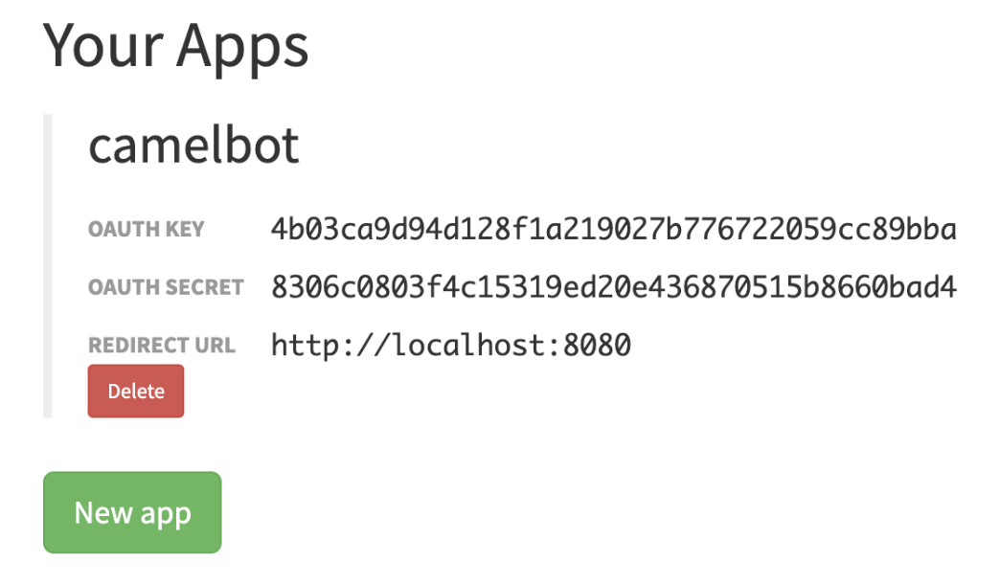

:toc:
:toc-placement!:

= Lab 1 - Gitter to Slack bridge

toc::[]

== Overview
This first stage is all about completing our first integration flow using a Kamelet Binding.

Difficulty level: +

* EASY

There is no previous Camel experience required. The picture billow illustrates the data flow traversing our Camel instance:

// image::images/processing-flow.png[title="Data flow",align="center",title-align=center, width=80%]
image::images/data-flow.png[align="center", width=80%]

The above process bridges chat messages from Gitter to Slack. It requires to enable access to both chat platforms. The instructions below will assist you in doing so.

== Access Gitter's chat platform

TIP: If you're unfamiliar with Gitter, it is an open-source chat platform designed for developers to have a space where to discuss project topics.

=== Create an App in Gitter.

. Login in Gitter
+
You can use one of the following accounts to join Gitter:
+
--
* GitHub
* GitLab
* Twitter
--
+
Login to Gitter's developer portal following the URL below: + 
https://developer.gitter.im/login
+
Once logged in, you'll be presented with your personal access token and an empty list of apps (if never created one before).
+
image::images/gitter-dev-token.png[align="left", width=30%,border-color="green", border-width="3"]
+
Create a new App that will communicate with Gitter:

1. Click `Your Apps -> New app`
+
1. Enter a new Name and set `\http://localhost:8080` as `Redirect URL`. For exameple:
+
--
```
Name:
  camelbot

Redirect URL:
  http://localhost:8080
```
Gitter will generate your App's access credentials, for example:


--


=== Authorise your App.

. We need to complete the OAuth web authentication flow.
+
.. Componse the following URL call:

		https://gitter.im/login/oauth/authorize?client_id=YOUR_APP_OAUTH_KEY&response_type=code&redirect_uri=http://localhost:8080
+
For example:

		https://gitter.im/login/oauth/authorize?client_id=4b03ca9d94d128f1a219027b776722059cc89bba&response_type=code&redirect_uri=http://localhost:8080
+

.. Open a browser tab, enter your URL in the address bar and press enter. The browser will load an authorization page as per the picture below:
+
image::images/gitter-dev-new-app-approve.png[align="left", width=30%,border-color="green", border-width="3"]
+
Click `ALLOW`.
+
The approval action will trigger a redirect that will cause a browser connection error since we we're not running a listening app on 8080, but it allows us to obtain the returned authorisation code from the address bar that should be similar to the following:
+
- \http://localhost:8080/?code=`0119b1eb4d69eb1c2bcf3c9a0570a711cd4b038b``
+
.. Take note of the code, now we have to exchange it to obtain an access token. Use the following cURL base command (replace values using your credentials).
+
```curl
CLIENT_ID=YOUR_APP_OAUTH_KEY \
CLIENT_SECRET=YOUR_APP_OAUTH_SECRET \
CODE=YOUR_REDIRECT_CODE \
&& \
curl -v https://gitter.im/login/oauth/token \
-H "accept: application/json" \
-d "client_id="$CLIENT_ID"&client_secret="$CLIENT_SECRET"&redirect_uri=http://localhost:8080&grant_type=authorization_code&code="$CODE
```
+
For example:
+
```curl
CLIENT_ID=4b03ca9d94d128f1a219027b776722059cc89bba \
CLIENT_SECRET=8306c0803f4c15319ed20e436870515b8660bad4 \
CODE=0119b1eb4d69eb1c2bcf3c9a0570a711cd4b038b \
&& \
curl -v https://gitter.im/login/oauth/token \
-H "accept: application/json" \
-d "client_id="$CLIENT_ID"&client_secret="$CLIENT_SECRET"&redirect_uri=http://localhost:8080&grant_type=authorization_code&code="$CODE
```
+
This above cURL command should return something like:
+
```json
{"access_token":"2d482bdf092e0e2299832b1f38d9560243083894","token_type":"Bearer"}
```
+
.. Now, use the returned token to obtain the Room IDs available using the following base command:
+
```curl
TOKEN=YOUR_ACCESS_TOKEN \
&& \
curl -v https://api.gitter.im/v1/rooms \
-H "Accept: application/json" \
-H "Authorization: Bearer "$TOKEN
```
+
For example:
+
```curl
TOKEN=2d482bdf092e0e2299832b1f38d9560243083894 \
&& \
curl -v https://api.gitter.im/v1/rooms \
-H "Accept: application/json" \
-H "Authorization: Bearer "$TOKEN
```
+
The command above will probably return an empty list if you have not yet joined any Gitter room.

=== Join a Gitter room.
. A number of public rooms were made available for this workshop (roomX). Choose a room number that nobody uses to avoid noisy conversations. Replace `YOUR_ROOM` in the following invite URL to join the lab room:

		https://gitter.im/test-lab-camel/YOUR_ROOM?utm_source=share-link&utm_medium=link&utm_campaign=share-link
+
For example, if choosing `room1`, use the following invite URL

		https://gitter.im/test-lab-camel/room1?utm_source=share-link&utm_medium=link&utm_campaign=share-link
+
Click `JOIN ROOM` at the bottom of the chat room. At this point you see your avatar included in the room on the right hand side of the room.
+
Running the cURL command again to obtain the rooms should return the identifier of the room you just joined, something similar to:
+
```json
[{"id":"6317569e6da03739849c519a"         }]
```
+
At this stage, you should have available all the configuration identifiers to define the Kamelet Binding in the next section using the following:
+
```properties
# Gitter credentials
gitter.token=YOUR_ACCESS_TOKEN
gitter.room=YOUR_ROOM_ID
```
+
For example
+
```properties
# Gitter credentials
gitter.token=2d482bdf092e0e2299832b1f38d9560243083894
gitter.room=6317569e6da03739849c519a
```

== Create the integration flow

=== Process overview

The diagram below illustrates the processing flow you're about to create:

image::images/processing-flow.png[align="center", width=80%]


* There are 3 Kamelets in use:
+
====
A source::
consumes events from Gitter
An action::
	transforms Gitter events to Slack events (in JSON format)
A sink::
	produces events to Slack
====

```

```

=== User profiles

This workshop has been designed to attend two different user profiles:

The Kubernetes user (no previous Camel experience)::
The way this user consumes Camel is by selecting catalog Kamelets and creating Kamelet bindings in YAML definitions. The user creates local YAML files and then pushes them to OpenShift. The Camel K operator automates the process of building, creating images and deploying the integrations. 

The Camel developer:: The traditional Camel developer would, first, typically use his local environment for the inner loop development cycle. This strategy allows speeding up the process of prototyping and validating the code. Once the basics covered, it would follow the same deployment flow as the Kubernetes user.

It's up to you to choose which user to impersonate. We recommend choosing the Camel developer, as the instructions will easily guide you, but if time is a constraint then choose the Kubernetes user.

=== The Camel user development flow

The tool that will help us to test locally is *Camel JBang*.

TIP: Camel JBang is an upstream tool for Camel. It is not supported yet by Red Hat but it is an extremely useful tool for all things Camel. It simplifies many of the common tasks with Camel. 

. To start with, we will simply consume Gitter messages and log them. We select the following 2 Kamelets to bind:
+
--
- gitter-source
- log-sink
--
+
Create a YAML file `g2s.yaml` (gitter to slack) containing the following definition:
+
```yaml
apiVersion: camel.apache.org/v1alpha1
kind: KameletBinding
metadata:
  name: g2s
spec:

  source:
    ref:
      kind: Kamelet
      apiVersion: camel.apache.org/v1
      name: gitter-source
    properties:
      token: "{{gitter.token}}"
      room:  "{{gitter.room}}"

  sink:
    ref:
      kind: Kamelet
      apiVersion: camel.apache.org/v1
      name: log-sink 
```
+
Now create the properties file `stage1.properties` containing the following entries:
+
```properties
# Allows HTTP streaming from Gitter
camel.main.streamCachingEnabled=false

# On shutdown it reduces waiting time when stoping Camel's streaming listener
camel.main.shutdownTimeout = 5

# Gitter credentials
gitter.token=YOUR_ACCESS_TOKEN
gitter.room=YOUR_ROOM_ID
```
+
IMPORTANT: You will notice the presence of the property `streamCachingEnabled` that requires to be disabled. This allows Camel to process the input as an continuous input stream.
+
NOTE: The `gitter-source` kamelet is implemented following the specification of Gitter's Streaming API to consume events from the server. To know more, read more its API documentation here: https://developer.gitter.im/docs/streaming-api

. Run your YAML definition with Camel JBang
+ 
Use the following command to run locally your Kamelet Binding:
+
```bash
camel run g2s.yaml \
--local-kamelet-dir=$PWD/../kamelets \
--properties=stage1.properties
```
+
Camel JBang will build a local runnable and start Camel. +
In the output logs you should see Camel connecting to Gitter, similar to the following:
+
```
	... : Apache Camel 3.18.0 (CamelJBang) started in 2s124ms (build:170ms init:1s738ms start:216ms JVM-uptime:4s)
	... : Opening connection to Gitter...
	... : Gitter HTTP Streaming started
```
+
Now, from Gitter's chat room, send a message, for example "Hello Camel". +
Your terminal should show the arrival of a Gitter event similar to the following JSON payload:
+
```json
{"id":"6318848405ad4a3701dccfb4","text":"Hello Camel","html":"Hello Camel","sent":"2022-09-07T11:46:12.825Z","readBy":0,"urls":[],"mentions":[],"issues":[],"meta":[],"v":1,"fromUser":{"id":"xxxxxxxxxxxxxxxx","username":"xxxxx"         }}
```
+
Hopefully you've been successful in capturing Gitter messages with Camel. +
Press `Ctrl`+`C` to stop Camel.
+
```
```
+
. Now we need to perform some data transformation to match the JSON sctructure the target system (Slack) requires.
+
We choose from the Kamelet Catalog the JSLT action to transform the body.
+
TIP: JSLT is a very convenient transformer to manipulate JSON payloads. It's inspired in XSLT (XML Transformation) to define stylesheets containing transformation rules for JSON.
+
Create the JSLT file `g2s.jslt` containing the following definition:
+
```json
{
    "channel":"TO_BE_DEFINED",
    "text":"*"+.fromUser.username+"@gitter*: "+.text
}
```
+
[NOTE]
====
* The field `channel` denotes the target room in Slack where messages will be pushed. For now we use a temporary value. +
* The field `text` includes JsonPath rules extracting values from the input Gitter event.
====
. Modify your YAML definition to include the JSLT action between your Kamelet source and sink.
+
The resulting YAML file should look as follows:
+
```yaml
apiVersion: camel.apache.org/v1alpha1
kind: KameletBinding
metadata:
  name: g2s
spec:

  source:
    ref:
      kind: Kamelet
      apiVersion: camel.apache.org/v1
      name: gitter-source
    properties:
      token: "{{gitter.token}}"
      room:  "{{gitter.room}}"

  steps:
  - ref:
      kind: Kamelet
      apiVersion: camel.apache.org/v1
      name: jslt-action
    properties:
      template: "g2s.jslt"

  sink:
    ref:
      kind: Kamelet
      apiVersion: camel.apache.org/v1
      name: log-sink 
```


=== The Kubernetes user deployment flow

gsgfg


==== Create Kamelet Binding skeleton

. To start with, we will simply consume Gitter messages and log them. We select the following 2 Kamelets to bind:
+
--
- gitter-source
- log-sink
--
+
Create a YAML file `g2s.yaml` (gitter 2 slack) containing the following definition:
+
```yaml
apiVersion: camel.apache.org/v1alpha1
kind: KameletBinding
metadata:
  name: g2s
spec:
  integration:
    configuration:
     - type: "secret"
       value: "stage1"
     - type: "configmap"
       value: "stage1-transform"

  source:
    ref:
      kind: Kamelet
      apiVersion: camel.apache.org/v1
      name: gitter-source
    properties:
      token: "{{secret:stage1/gitter.token}}"
      room:  "{{secret:stage1/gitter.room}}"

  sink:
    ref:
      kind: Kamelet
      apiVersion: camel.apache.org/v1
      name: log-sink 
```
+
Now create the properties file `stage1.properties` containing the following entries:
+
```properties
# Allows HTTP streaming from Gitter
camel.main.streamCachingEnabled=false

# Gitter credentials
gitter.token=YOUR_ACCESS_TOKEN
gitter.room=YOUR_ROOM_ID
```

IMPORTANT: You will notice the presence of the property `streamCachingEnabled` that requires to be disabled. This allows Camel to process the input as an continuous input stream.

NOTE: The `gitter-source` kamelet is implemented following the specification of Gitter's Streaming API to consume events from the server. To know more, read more its API documentation here: https://developer.gitter.im/docs/streaming-api
