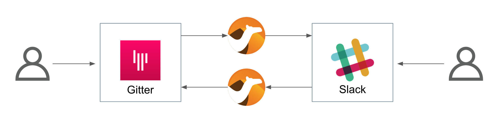
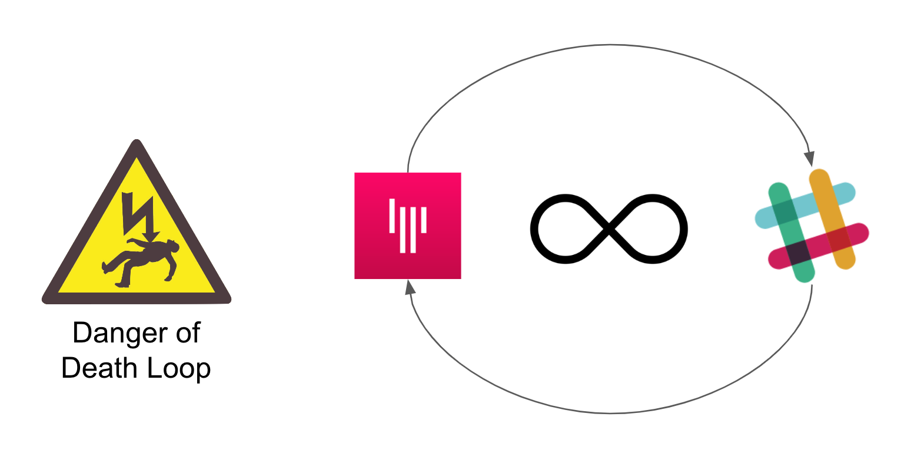
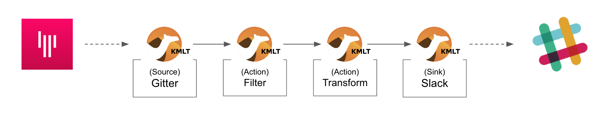

:toc:
:toc-placement!:

= Lab 2 - Gitter to Slack bridge (bi-directional)

toc::[]

== Overview
Lab 1 enabled a Gitter to Slack data flow. On this second lab we want the flow to work in both directions so that users from both chat platforms can exchange messages and have a conversation.

Difficulty level: +

* *EASY*

Target persona: +

* *Kubernetes User*

[NOTE]
--
Since the first lab covered in detail the workflows for both personas, we consider you're now well equipped with the knowledge and tools to choose your preferred methodology going forward.

From now on, we simplify the instructions with code snippets directly deployable in OpenShift. Feel free to modify the snippets accordingly if you'd like to test the code locally (as a Camel expert). 
--

{empty} +

The picture billow illustrates two data flows interconnecting both chat systems, one for each direction of communication:

// image::images/processing-flow.png[title="Data flow",align="center",title-align=center, width=80%]

Luckily for us, we've already done all the necessary onboarding setup with both chat systems, so this lab should be a lot faster to complete than the first one.

{empty} +

== Create the integration flows

=== Gitter to Slack flow

This process is identical to the one we've already created in Lab 1, except there is situation we need to prevent. Let's ask ourselves the following:

* If the App in a room fires an event for each new message in a conversation, what will happen when we interconnect both Apps?

Obviously, the interaction between both platforms would enter in a ping-pong effect between the App in Gitter and the App in Slack.

We need to put in place a filtering mechanism that will prevent the interaction from entering in a death loop.

{empty} +

==== Process overview

The diagram below illustrates the processing flow you're about to create:

* There are 4 Kamelets in use:
+
====
A source::
consumes events from Gitter.
+
{empty} +

Two actions::
--
. one filters messages to prevent death loops.
. one transforms Gitter events to Slack events (in JSON format).
--

{empty} +

A sink::
	produces events to Slack.
====

{empty} +

You can tell from the list above that this second lab suits very well the _Kubernetes_ user persona: all the integration process involves is defining a _Kamelet Binding_ with a sequence of _Kamelets_ in them.

{empty} +

==== Process definition

. Use your Stage1 sources as a base
+
Let's start by making a copy of your previous work, and renaming all the occurrences of `stage1` by `stage2`

