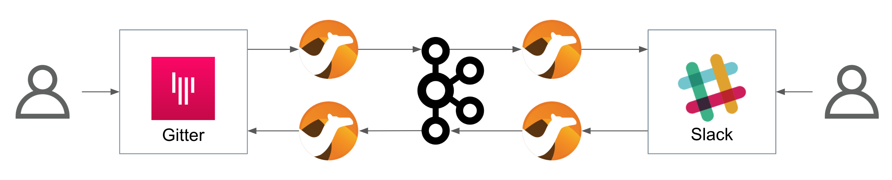
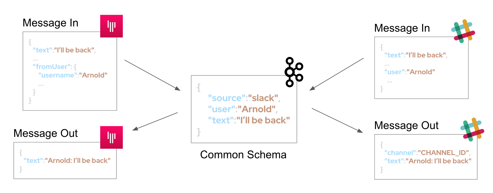
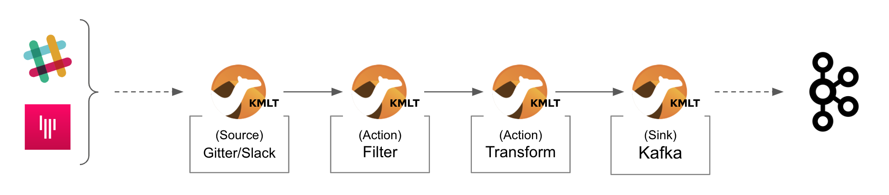

:toc:
:toc-placement!:

= Lab 3 - Gitter ⇔ Kafka ⇔ Slack (via streams)

toc::[]

== Overview
Lab 1 and 2 enabled Gitter/Slack conversations. However their connectivity was tightly coupled with dedicated data translations between both platforms. On this third lab we want to break them away to open up the architecture to welcome additional systems and services.

Difficulty level: +

* *EASY*

Estimated time: +

* *20 mn*

Target persona: +

* *Kubernetes User*

{empty} +


The picture billow illustrates an asynchronous decoupled architecture, via a streaming platform (kafka). This approach increases the number of data flows from two to four.

TIP: At first it seems unnecessary to double the number of data flows, but benefits outweighs complexity, we gain an easily extensible architecture. In later labs you'll see new additions to the architecture.

// image::images/processing-flow.png[title="Data flow",align="center",title-align=center, width=80%]


In terms of implementation effort for this lab, your main task is to split each of your current data flows (from Lab-2) in two different parts:

- The Gitter to Slack process into:
. Gitter to Kafka
. Kafka to Slack
- The Slack to Gitter process into:
. Slack to Kafka
. Kafka to Gitter

{empty} +

One fundamental architecture consideration is that if we want an easy to plugin platform where other communication systems or services need to plugin with ease, we should adopt a standard data model. It would establish a common interface for systems willing to integrate with the platform.

This implies that instead of applying platform specific data transformations (eg. Gitter data model to Slack data model), we apply the following data transformations:

- System specific to standard data model (e.g. Gitter/Slack to Kafka)
- Standard data model to System specific (e.g. Kafka to Gitter/Slack)

The illustration below describes data exchanges via Kafka:



{empty} +

== Gitter/Slack to Kafka

The two data flows we have created in previous labs are almost identical in terms of processing steps, those are:

. receive events
. filter events
. transform events
. push events

For the Gitter/Slack to Kafka process, the steps are the same, we just need to switch to the standard data model (step 3) and target Kafka (step 4).

{empty} +

=== Process overview

The diagram below applies to the data flows (2 of them) from Gitter/Slack respectively to Kafka:




* There are 4 Kamelets in use:
+
====
A source::
consumes events from Gitter/Slack.
Two actions::
one filters messages to prevent death loops. +
one transforms Gitter events to the standard data model.
A sink::
	produces events to Kafka.
====

{empty} +

As in lab 1 & 2, this one also fits the _Kubernetes_ user. We compose the definitions using Kamelets to enable the data flows between the different platforms.

{empty} +

=== Gitter to Kafka

. Setup
+
We continue growing our solution where we left it in Lab 2. +
We use Lab-2 as the base for this next stage.
+
The following set of instructions prepare the set of files you will be working with: 
+
.. Prepare Lab 3 folder
+
```bash
cp -r lab2 lab3
cd lab3
mv stage2.properties stage3.properties
grep -rl stage2 . | xargs sed -i '' 's/stage2/stage3/g'
 
```
+
.. Split each YAML file in two:
+
```bash
mv g2s.yaml g2k.yaml
cp g2k.yaml k2s.yaml
mv s2g.yaml s2k.yaml
cp s2k.yaml k2g.yaml
mkdir flows
mv *.yaml flows/ 
```
+
.. Rename the bindings:
+
```bash
sed -i '' 's/g2s/g2k/g' flows/g2k.yaml
sed -i '' 's/g2s/k2s/g' flows/k2s.yaml
sed -i '' 's/s2g/s2k/g' flows/s2k.yaml
sed -i '' 's/s2g/k2g/g' flows/k2g.yaml
```
+
.. Prepare JSLTs:
+
```bash
rm *.jslt
mkdir maps
touch maps/g2k.jslt
touch maps/k2s.jslt
touch maps/s2k.jslt
touch maps/k2g.jslt
 
```

. Define the JSLT transformation to the new standard data model.
+
Copy the snippet below and paste it into your new `s2k.jslt` file:
+
```
{
	"timestamp": string(round(parse-time(.sent, "yyyy-MM-dd'T'HH:mm:ss.SSSX"))),
	"source":"gitter", 
	"user": .fromUser.displayName, 
	"text": .text
}
```
+
[NOTE]
====
We include various fields to provide context.
====
{empty} +

. Replace the sink to target Kafka
+
The original definition remains intact except for the sink to be replaced by a _Kafka_ destination. +
Copy the sink snippet down below and paste it in your _Kamelet Binding_:
+
----
apiVersion: camel.apache.org/v1alpha1
kind: KameletBinding
metadata:
  name: g2k
  annotations:
    trait.camel.apache.org/mount.configs: "secret:stage3"
    trait.camel.apache.org/mount.resources: "configmap:stage3-transform"
spec:

  source:
    ref:
      kind: Kamelet
      apiVersion: camel.apache.org/v1
      name: gitter-source
    properties:
      token: "{{gitter.token}}"
      room:  "{{gitter.room}}"

  steps:

  # Filter BOT messages
  # Bot message pattern is: [username@system: message text] -->
  - ref:
      kind: Kamelet
      apiVersion: camel.apache.org/v1
      name: predicate-filter-action
    properties:
      expression: $.text =~ /(?!\*\*.*@.*\*\*:).*/

  - ref:
      kind: Kamelet
      apiVersion: camel.apache.org/v1
      name: jslt-action
    properties:
      template: g2k.jslt
----
+
```yaml
  sink:
    ref:
      kind: KafkaTopic
      apiVersion: kafka.strimzi.io/v1beta1
      name: YOUR_ROOM_NAME
```
+
[IMPORTANT]
====
Ensure you configure the sink's `name` (Kafka topic) by replacing `YOUR_ROOM_NAME` with your chat's room name.
====
+
[NOTE]
====
* The sink definition in a Kamelet Binding can either be a Kamelet Sink from the Catalog, or a platform resource (Kafka or KNative).
* Kafka definitions just require the name of the topic. The Camel K operator automatically wires the connectivity to the Kafka platform available in the environment.
====
{empty} +

. Include the filter
+
There is a convenient Kamelet in the _Catalog_ fit for this purpose:
+
--
* `predicate-filter-action`
+
Reference:: https://camel.apache.org/camel-kamelets/0.8.x/predicate-filter-action.html
--
This _Kamelet_ action applies a _JsonPath_ expression where we can use a regular expression operator to match the blocking pattern. 
+
The challenge with _Gitter_, contrary to other chat platforms, is that there's no field (within the incoming event) indicating if the message is from a human or an app. To distinguish one from the other, we need to come up with a pattern that works for us.
+
--
Given our JSLT converts messages to the following format:

* `username@system:`  message
--
+
It makes sense to use the same pattern to identify and block incoming events since we know they are app-generated by Camel's JSLT transformation.
+
With all the above in mind, let's include a `filter-action` Kamelet, as an additional step, that does just what's needed.
+
Copy the filter snippet below and paste it in your Kamelet Binding:
+
----
apiVersion: camel.apache.org/v1alpha1
kind: KameletBinding
metadata:
  name: g2s
  annotations:
    trait.camel.apache.org/mount.configs: "secret:stage2"
    trait.camel.apache.org/mount.resources: "configmap:stage2-transform"
spec:

  source:
    ref:
      kind: Kamelet
      apiVersion: camel.apache.org/v1
      name: gitter-source
    properties:
      token: "{{gitter.token}}"
      room:  "{{gitter.room}}"

  steps:
----
+
```yaml
  # Filter BOT messages
  # Bot message pattern is: [username@system: message text] -->
  - ref:
      kind: Kamelet
      apiVersion: camel.apache.org/v1
      name: predicate-filter-action
    properties:
      expression: $.text =~ /(?!\*\*.*@.*\*\*:).*/
```
+
----
  - ref:
      kind: Kamelet
      apiVersion: camel.apache.org/v1
      name: jslt-action
    properties:
      template: g2s.jslt

  sink:
    ref:
      kind: Kamelet
      apiVersion: camel.apache.org/v1
      name: slack-sink
    properties:
      token: "{{slack.token}}"
----
+
In the filter above you'll notice the expression is picking the `text` JSON field and matching it with the regular expression that takes in account the _Markdown_ syntax that Gitter uses.
+
{empty} + 

. Push the configuration to _OpenShift_
+
Create the corresponding _ConfigMap_ and _Secret_ for _Stage2_. +
Run the following `oc` command:
+
```bash
oc create cm stage2-transform --from-file=g2s.jslt
oc create secret generic stage2 --from-file=stage2.properties

```
{empty} +

. Deploy the YAML definition containing your new Kamelet Binding
.. Run the following `oc` command to deploy the integration:
+
```bash
oc apply -f g2s.yaml

```
+
NOTE: Be patient, this action will take some time to complete as the operator needs to download all the filter's maven dependencies, build the application and create the image before the integration can be deployed.

.. Check your deployment
+
Check the pod's deployment and logs to ensure all is in healthy state.
+
{empty} +

. Test the filter from Gitter
+
Now, from Gitter's chat room, send a message, for example "go through".
+
If all goes well your message should show up in Slack's chat room.
+
Now, let's fake a message pretending it is generated by _Camel_. Copy the following message, then paste and send in _Gitter_:
+
```
**fakebot@gitter**: fake app message
```
+
The expectation is to see the filter in action blocking the message and not reaching Slack at all.
+
Was that the case? if not, try to find out why, resolve, and try again. +
Otherwise, if the message got indeed blocked, then the data flow is ready. Continue below with the second data flow.

+
{empty} +


=== Slack to Gitter

This process is equivalent to the previous one, but designed to enable the opposite data flow.

It also requires a filtering mechanism to block events from Slack, originally emitted from Gitter-to-Slack Camel transactions.

{empty} +

==== Process overview

The diagram below illustrates the processing flow:

image::images/processing-flow-s2g.png[align="center", width=80%]


* There are 4 Kamelets in use:
+
====
A source::
consumes events from Slack.
Two actions::
one filters messages to prevent death loops. +
one transforms Slack events to Gitter events (in JSON format).
A sink::
	produces events to Gitter.
====


{empty} +

==== Process definition

. Create the YAML definition.
+
Run the following command to crate the YAML file:
+
```bash
touch s2g.yaml

```

. Define its source
+
Copy the snippet below and paste it into your new `s2g.yaml` file:
+
```yaml
apiVersion: camel.apache.org/v1alpha1
kind: KameletBinding
metadata:
  name: s2g
  annotations:
    trait.camel.apache.org/mount.configs: "secret:stage2"
    trait.camel.apache.org/mount.resources: "configmap:stage2-transform"
spec:

  source:
    ref:
      kind: Kamelet
      apiVersion: camel.apache.org/v1
      name: slack-source
    properties:
      token:   "{{slack.token}}"
      channel: "{{slack.channel.name}}"
      delay: 2000


  steps:

  # Filter BOT messages
  - ref:
      kind: Kamelet
      apiVersion: camel.apache.org/v1
      name: predicate-filter-action
    properties:
      expression: "!$.botId || $.botId == null"
  
  # JSON Transformation
  - ref:
      kind: Kamelet
      apiVersion: camel.apache.org/v1
      name: jslt-action
    properties:
      template: "{{transform.path:s2g.jslt}}"


  sink:
    ref:
      kind: Kamelet
      apiVersion: camel.apache.org/v1
      name: gitter-sink
    properties:
      token: "{{gitter.token}}"
      room: "{{gitter.room}}"
```
+
[NOTE]
--
* The source Kamelet is now Slack
* The sink Kamelet is now Gitter
--
+
[NOTE]
--
The filter is simpler, because Slack includes a `botId` field when messages are App generated.

* Its expression allows messages to go through when not including `botId` (or equal to null).
--
+
{empty} +

. Include an extra _Slack_ parameter to your properties file.
+
Copy from below the parameter definition `slack.channel.name`, paste it into your properties file, and set its value to the Slack room you're using.
+
----
# Allows HTTP streaming from Gitter
camel.main.streamCachingEnabled=false

# Gitter credentials
gitter.token=2d482bdf092e0e2299832b1f38d9560243083894
gitter.room=6317569e6da03739849c519a

# Slack credentials
slack.token=YOUR_TOKEN
----
+
```properties
slack.channel.name=YOUR_SLACK_ROOM
```
+
{empty} +

. Define the JSLT transformation.
+
.. Run the following command to crate the JSLT file:
+
```bash
touch s2g.jslt

```
+
.. Define its mapping definition.
+
Copy the snippet below and paste it into your new `s2g.jslt` file:
+
```
{
    "text":"**"+.user+"@slack**: "+.text
}
```
+
[NOTE]
====
* When targeting _Slack_, the target room is configured at the sink, not in the JSON payload. +
* The field `text` includes JsonPath rules extracting values from Slack input events.
====
{empty} +

. Push the configuration to _OpenShift_
+
Recreate the _Secret_ and _ConfigMap_ to include both JSLTs. +
Run the following `oc` command:
+
```bash
oc delete secret stage2
oc create secret generic stage2 --from-file=stage2.properties

oc delete cm stage2-transform
oc create cm stage2-transform --from-file=g2s.jslt --from-file=s2g.jslt

```
{empty} +

. Deploy the YAML definition containing your new Kamelet Binding
.. Run the following `oc` command to deploy the integration:
+
```bash
oc apply -f s2g.yaml

```
+
NOTE: Be patient, this action will take some time to complete as the operator needs to download all the filter's maven dependencies, build the application and create the image before the integration can be deployed.

.. Wait for readyness
+
Check the pod's deployment and logs to ensure all is in healthy state.
+
{empty} +

. Test the integration from Slack.
+
Go to you Slack's chat room and send a message, for example "Hello from Slack".
+
If all goes well your message should show up in Gitter.
+
image::images/stage2-msg-slack-gitter.png[align="left", width=80%]
+
[NOTE]
--
You will notice two inmediate differences:

* When pushing messages from _Camel_, Gitter shows them as a user, not as an App. Slack however, does not allow Apps to impersonate users.
* Slack does not provide the real user name, instead it provides its ID.
--
+
[NOTE]
--
An interesting exercise would be to replace Slack's user ID by the real user name. We leave this task for a future more advanced scenario.
--
+
{empty} +

. Ensure the filter works.
+
We now have both flows in place:
+
--
* Gitter to Slack
* Slack to Gitter
--
+
As a final step, to test the filter and validate it's working well, let's ensure that Gitter-to-Slack messages do not circle back to Gitter.
+
From your Gitter chat room, send a message. +
The expected outcome should be as follows:

* You see the message in Slack
* You don't see a new message in Gitter


+
{empty} +

You have now completed Stage 2 !!
