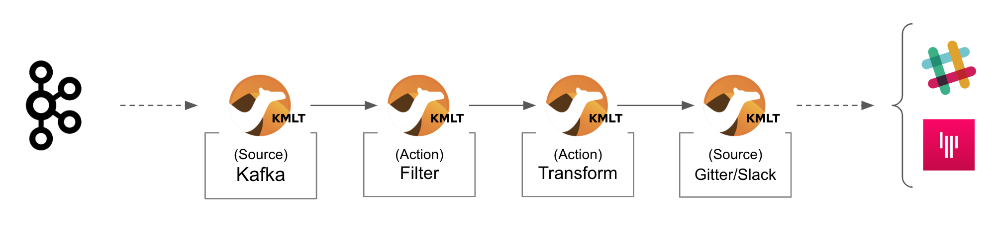

:toc:
:toc-placement!:

= Lab 3 - Gitter ⇔ Kafka ⇔ Slack (via streams)

toc::[]

== Overview
Lab 1 and 2 enabled Gitter/Slack conversations. However their connectivity was tightly coupled with dedicated data translations between both platforms. On this third lab we want to break them away to open up the architecture to welcome additional systems and services.

Difficulty level: +

* *EASY*

Estimated time: +

* *20 mn*

Target persona: +

* *Kubernetes User*

{empty} +


The picture billow illustrates an asynchronous decoupled architecture, via a streaming platform (kafka). This approach increases the number of data flows from two to four.

TIP: At first it seems unnecessary to double the number of data flows, but benefits outweighs complexity, we gain an easily extensible architecture. In later labs you'll see new additions to the architecture.

// image::images/processing-flow.png[title="Data flow",align="center",title-align=center, width=80%]
image::images/data-flow.png[align="center", width=90%]

In terms of implementation effort for this lab, your main task is to split each of your current data flows (from Lab-2) in two different parts:

- The Gitter to Slack process into:
. Gitter to Kafka
. Kafka to Slack
- The Slack to Gitter process into:
. Slack to Kafka
. Kafka to Gitter

{empty} +

One fundamental architecture consideration is that if we want an easy to plugin platform where other communication systems or services need to plugin with ease, we should adopt a standard data model. It would establish a common interface for systems willing to integrate with the platform.

This implies that instead of applying platform specific data transformations (eg. Gitter data model to Slack data model), we apply the following data transformations:

- System specific to standard data model (e.g. Gitter/Slack to Kafka)
- Standard data model to System specific (e.g. Kafka to Gitter/Slack)

The illustration below describes data exchanges via Kafka:

image::images/standard-data-model.png[align="center", width=90%]

{empty} +


== Setup

We continue growing our solution where we left it in Lab 2. +
We use Lab-2 as the base for this next stage.

The following set of instructions prepare the set of files you will be working with: 

. Prepare Lab 3 folder
+
```bash
cp -r lab2 lab3
cd lab3
mv stage2.properties stage3.properties
grep -rl stage2 . | xargs sed -i '' 's/stage2/stage3/g'
 
```
+
. Split each YAML file in two:
+
```bash
mv g2s.yaml g2k.yaml
cp g2k.yaml k2s.yaml
mv s2g.yaml s2k.yaml
cp s2k.yaml k2g.yaml
mkdir flows
mv *.yaml flows/ 
```
+
. Rename the bindings:
+
```bash
sed -i '' 's/g2s/g2k/g' flows/g2k.yaml
sed -i '' 's/g2s/k2s/g' flows/k2s.yaml
sed -i '' 's/s2g/s2k/g' flows/s2k.yaml
sed -i '' 's/s2g/k2g/g' flows/k2g.yaml
```
+
. Prepare JSLTs:
+
```bash
rm *.jslt
mkdir maps
touch maps/g2k.jslt
touch maps/k2s.jslt
touch maps/s2k.jslt
touch maps/k2g.jslt
 
```

You're ready to go.

{empty} +

== Gitter/Slack to Kafka

The two data flows we have created in previous labs are almost identical in terms of processing steps, those are:

. receive events
. filter events
. transform events
. push events

For the Gitter/Slack to Kafka processes, the steps are the same, we just need to switch to the standard data model (step 3) and target Kafka (step 4).

{empty} +

=== Process overview

The diagram below applies to the data flows (2 of them) from Gitter/Slack respectively to Kafka:

image::images/processing-flow-chat2kafka.png[align="center", width=90%]


* There are 4 Kamelets in use:
+
====
A source::
consumes events from Gitter/Slack.
Two actions::
one filters messages to prevent death loops. +
one transforms Gitter/Slack events to the standard data model.
A sink::
	produces events to Kafka.
====

{empty} +

As in lab 1 & 2, this one also fits the _Kubernetes_ user. We compose the definitions using Kamelets to enable the data flows between the different platforms.

{empty} +

=== Gitter to Kafka

. Replace the sink to target Kafka
+
The original definition remains intact except for the sink to be replaced by a _Kafka_ destination. +
Copy the sink snippet down below and paste it in your _Kamelet Binding_:
+
----
apiVersion: camel.apache.org/v1alpha1
kind: KameletBinding
metadata:
  name: g2k
  annotations:
    trait.camel.apache.org/mount.configs: "secret:stage3"
    trait.camel.apache.org/mount.resources: "configmap:stage3-transform"
spec:

  source:
    ref:
      kind: Kamelet
      apiVersion: camel.apache.org/v1
      name: gitter-source
    properties:
      token: "{{gitter.token}}"
      room:  "{{gitter.room}}"

  steps:

  # Filter BOT messages
  # Bot message pattern is: [username@system: message text] -->
  - ref:
      kind: Kamelet
      apiVersion: camel.apache.org/v1
      name: predicate-filter-action
    properties:
      expression: $.text =~ /(?!\*\*.*@.*\*\*:).*/

  - ref:
      kind: Kamelet
      apiVersion: camel.apache.org/v1
      name: jslt-action
    properties:
      template: g2k.jslt
----
+
```yaml
  sink:
    ref:
      kind: KafkaTopic
      apiVersion: kafka.strimzi.io/v1beta1
      name: YOUR_ROOM_NAME
```
+
[IMPORTANT]
====
Ensure you configure the sink's `name` (Kafka topic) by replacing `YOUR_ROOM_NAME` with your chat's room name.
====
+
[NOTE]
====
* The sink definition in a Kamelet Binding can either be a Kamelet Sink from the Catalog, or a platform resource (Kafka or KNative).
* Kafka definitions just require the name of the topic. The Camel K operator automatically wires the connectivity to the Kafka platform available in the environment.
====
{empty} +

. Define the JSLT transformation to the new standard data model.
+
Copy the snippet below and paste it into your new `s2k.jslt` file:
+
```
{
	"timestamp": string(round(parse-time(.sent, "yyyy-MM-dd'T'HH:mm:ss.SSSX"))),
	"source":"gitter", 
	"user": .fromUser.displayName, 
	"text": .text
}
```
+
[NOTE]
====
* We include various fields to provide context.
* We apply a format on the timestamp to match those from other sources.
====
{empty} +

And that's all it takes for this first stint.

{empty} +


=== Slack to Kafka

Very similar changes apply for the Slack -> Kafka flow.

. Replace the sink to target Kafka
+
The original definition remains intact except for the sink to be replaced by a _Kafka_ destination. +
Copy the sink snippet down below and paste it in your _Kamelet Binding_:
+
----
apiVersion: camel.apache.org/v1alpha1
kind: KameletBinding
metadata:
  name: s2k
  annotations:
    trait.camel.apache.org/mount.configs: "secret:stage3"
    trait.camel.apache.org/mount.resources: "configmap:stage3-transform"
spec:

  source:
    ref:
      kind: Kamelet
      apiVersion: camel.apache.org/v1
      name: slack-source
    properties:
      token:   "{{slack.token}}"
      channel: "{{slack.channel.name}}"
      delay: 2000


  steps:

  # Filter BOT messages
  - ref:
      kind: Kamelet
      apiVersion: camel.apache.org/v1
      name: predicate-filter-action
    properties:
      expression: "!$.botId || $.botId == null"

  # JSON Transformation
  - ref:
      kind: Kamelet
      apiVersion: camel.apache.org/v1
      name: jslt-action
    properties:
      template: "{{transform.path:s2k.jslt}}"
----
+
```yaml
  sink:
    ref:
      kind: KafkaTopic
      apiVersion: kafka.strimzi.io/v1beta1
      name: YOUR_ROOM_NAME
```
+
[IMPORTANT]
====
Use the same sink's `name` (Kafka topic) than on your Gitter to Kafka flow.
====
+
{empty} +

. Define the JSLT transformation to the new standard data model.
+
Copy the snippet below and paste it into your new `s2k.jslt` file:
+
```
{
	"timestamp": .ts,
	"source":"slack", 
	"user": .user, 
	"text": .text
}
```
+
[NOTE]
====
We define the same common fields complying with our standard data model.
====
{empty} +

Very straightforward, nothing else to be done here. 

{empty} +


== Kafka to Gitter/Slack

The processing steps still remain essentially the same:

. receive events
. filter events
. transform events
. push events

The main differences are that we are consuming events from Kafka (step 1) and that we have to translate events (step 3) from the standard data model to the target specific model (e.g. Gitter, Slack, other)

{empty} +

=== Process overview

The diagram below applies to the data flows (2 of them) from Gitter/Slack respectively to Kafka:




* There are 4 Kamelets in use:
+
====
A source::
consumes events from Kafka.
Two actions::
one filters messages to prevent death loops. +
one transforms events from the standard data model to Gitter/Slack.
A sink::
produces events to Gitter/Slack.
====

{empty} +


=== Kafka to Gitter

. Modify the Kamelet Binding
+
Two modifications are required:
+
--
* The source is now Kafka
* The filter should blocks self-events
--
+
Copy the corresponding snippets and replace in your _Kamelet Binding_:
+
----
apiVersion: camel.apache.org/v1alpha1
kind: KameletBinding
metadata:
  name: k2g
  annotations:
    trait.camel.apache.org/mount.configs: "secret:stage3"
    trait.camel.apache.org/mount.resources: "configmap:stage3-transform"
spec:
----
+
```yaml
  source:
    ref:
      kind: KafkaTopic
      apiVersion: kafka.strimzi.io/v1beta1
      name: YOUR_ROOM_NAME
```
+
----
  steps:

  # Filter BOT messages
  # Bot message pattern is: [username@system: message text] -->
  - ref:
      kind: Kamelet
      apiVersion: camel.apache.org/v1
      name: predicate-filter-action
    properties:
----
+
```yaml
      expression: $.source != "gitter"
```
+
----
  - ref:
      kind: Kamelet
      apiVersion: camel.apache.org/v1
      name: jslt-action
    properties:
      template: "{{transform.path:k2g.jslt}}"

  sink:
    ref:
      kind: Kamelet
      apiVersion: camel.apache.org/v1
      name: gitter-sink
    properties:
      token: "{{gitter.token}}"
      room: "{{gitter.room}}"
----
+
[IMPORTANT]
====
Ensure you configure the source's `name` (Kafka topic) by replacing `YOUR_ROOM_NAME` with your chat's room name.
====
+
[NOTE]
====
The filter definition is specifically blocking events coming from Gitter itself. As now Kafka sits in the middle, we are simultaneously producing and consuming Kafka events from/to Gitter, which can cause event loops. 
====
+
[NOTE]
====
* The source definition in a Kamelet Binding can either be a Kamelet Source from the Catalog, or a platform resource (Kafka or KNative). The operator auto-wires the connectivity to Kafka for us.
====
{empty} +

. Define the JSLT transformation (Standard -> Gitter).
+
Copy the snippet below and paste it into your new `k2g.jslt` file:
+
```
{
    "text":"**"+.user+"@"+.source+"**: "+.text
}
```
+
[NOTE]
====
We're mapping values from the Standard data model
====
{empty} +

And that's all it takes for this first stint.

{empty} +


=== Kafka to Slack

Very similar changes apply for the Kafka -> Slack flow.


. Modify the Kamelet Binding
+
Two modifications are required:
+
--
* The source is now Kafka
* The filter should blocks self-events
--
+
Copy the corresponding snippets and replace in your _Kamelet Binding_:
+
----
apiVersion: camel.apache.org/v1alpha1
kind: KameletBinding
metadata:
  name: k2s
  annotations:
    trait.camel.apache.org/mount.configs: "secret:stage3"
    trait.camel.apache.org/mount.resources: "configmap:stage3-transform"
spec:
----
+
```yaml
  source:
    ref:
      kind: KafkaTopic
      apiVersion: kafka.strimzi.io/v1beta1
      name: YOUR_ROOM_NAME
```
+
----
  steps:

  # Filter BOT messages
  # Bot message pattern is: [username@system: message text] -->
  - ref:
      kind: Kamelet
      apiVersion: camel.apache.org/v1
      name: predicate-filter-action
    properties:
----
+
```yaml
      expression: $.source != "slack"
```
+
----
  - ref:
      kind: Kamelet
      apiVersion: camel.apache.org/v1
      name: jslt-action
    properties:
      template: "{{transform.path:k2s.jslt}}"

  sink:
    ref:
      kind: Kamelet
      apiVersion: camel.apache.org/v1
      name: slack-sink
    properties:
      token: "{{slack.token}}"
----
+
[IMPORTANT]
====
Ensure you configure the source's `name` (Kafka topic) by replacing `YOUR_ROOM_NAME` with your chat's room name.
====
+
[NOTE]
====
The filter definition is specifically blocking events coming from _Slack_ itself. As now Kafka sits in the middle, we are simultaneously producing and consuming Kafka events from/to _Slack_, which can cause event loops. 
====
+
{empty} +

. Define the JSLT transformation (Standard -> Slack).
+
Copy the snippet below and paste it into your new `k2s.jslt` file:
+
```
{
    "channel":"YOUR_ROOM",
    "text":"*"+.user+"@"+.source+"*: "+.text
}
```
+
[NOTE]
====
* The field `channel` denotes the target room in Slack where messages will be pushed. Use your room ID in Slack. +
* The field `text` includes JsonPath rules extracting values from the input Standard data model.
====
{empty} +

And that's all it takes for this first stint.

{empty} +


+
{empty} +

You have now completed Stage 3 !!
