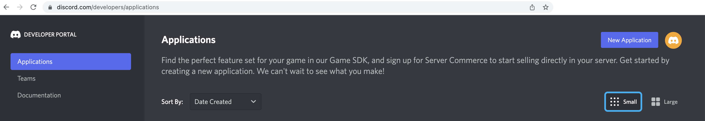

:toc:
:toc-placement!:

toc::[]

== Discord's platform onboarding

TIP: If you're unfamiliar with _Discord_, it is a well known chat platform, very popular among gamers, but more and more embraced by enterprises for internal communications and to connect with their clients.

[NOTE]
--
If you have never used _Discord_ before, register by using your email address, nothing else is needed.

* https://discord.com/register
--

{empty} +

=== Join a Discord server.

To accelerate the onboarding process in _Discord_, we've created a shared server for anyone to freely join and use for the purpose of this enablement workshop. 

Follow the invite link to join the workshop's server in _Discord_:

* https://discord.gg/4PyTjzjJJz

CAUTION: The server is open to the public, please be mindful of your actions, don't abuse the space.

[NOTE]
--
if you were unsuccessful joining the shared server provided, feel free to create you own _Discord_ server, you should be able to complete the workshop in the same manner.

To create your own server, click the `+` (add a server) button, select `Create My Own`, and then `For me and my friends` (private server). 
--
{empty} +

=== Join a Discord room (channel).
. A number of rooms have been made available in the shared server for the workshop (room1, room2, ...roomX). Choose a room number that nobody uses to avoid noisy conversations.
+
Alternatively, you can also create your own room (channel), use the prefix `room_`, for example:

* `room_x`

{empty} +

=== Connecting Camel to Discord

To connect from _Camel_ to the chat platform, an App needs to be registered in _Discord_. You would just need to add the registered App to a particular room to allow _Camel_ to pick up messages.

* If you are running your own workshop you'll have to create an App in _Discord_. Click the link below to follow instructions on how to create your own App.

** link:#creating-your-own-app-for-discord[Creating your own App for Discord]

* If you're part of a workshop group, an App has been made available for all students to share. Proceed with the instructions that follow to add the shared App to your selected room.

{empty} +

==== Return to the main walkthrough guide

You are now ready to complete your integration definition. +
Click the link below to jump back to the main guide walktrough:

* link:walkthrough.adoc#discord-onboarding[Back to the main Stage 4 instructions]

{empty} +

==== [[creating-your-own-app-for-discord]] Creating your own App for Discord

. Connect to the following URL
+
--
* https://discord.com/developers
+
If you have never used _Discord_ before, register by using your email address, nothing else is needed.
--
+
{empty} +

. Create an App
+
Once in, you'll see your applications dashboard with an empty list of apps (if never created one before).
+

+
.. Click the `New Application` button
+
image::images/discord-create-app.png[align="left", width=20%]
+
.. Give it a name, for example `MyCamelApp`. +
Click `Create`
+
Once the App created you'll be presented with its `General Information`
+
.. Add bot
+
Select from the left menu:
+
--
* SETTINGS => Bot => Add Bot
+
Click `Yes, do it!`
--
+
.. Reset token
+
Discord only shows the Bot token once, make sure you keep note of it.
+
Click `Reset Token`. +
Then, click `Yes, do it!`
+
The new token will be shown on screen as follows:
+
image::images/discord-app-token.png[align="left", width=90%]
+
Copy and keep it safe, you'll need it when configuring Camel.

{empty} +

. Grant permissions 
+
Select from the left menu:
+
* SETTINGS => OAuth2 => URL Generator
+
.. From `SCOPES` select:
+
--
- bot
--
+
This action will reveal `BOT PERMISSIONS`

.. From `BOT PERMISSIONS` select:
+
--
- GENERAL PERMISSIONS -> Read Messages / View Channels
- TEXT PERMISSIONS -> Send Messages
--
+
Selecting the permissions above shapes a generated URL presented below. +
Scroll down to see the gerented URL, it should look as follows:
+
image::images/discord-app-generated-url.png[align="left", width=100%]
+
Click `Copy`
+
{empty} +

. Authorize your App
+
Open a new tab in your browser and paste the generated URL in the address bar.
+
The browser will load an authorization page. +
Select the Discord server you have previously created. +
Then click `Continue`.
+
You then are presented with a summary of bot permissions to authorize, as per the picture below:
+
image::images/discord-app-auth.png[align="left", width=30%]
+
click `Authorize`. +
Tick `I'm a human`.
+
When the authorization process is done you can close the tab.

{empty} +

Your App should now be visible as a member of the server, with offline status.

In Discord, Apps that are member of a server, automatically become members of all the server channels (rooms).

Click the link below to jump (scroll up) to the section with instructions on how to add your app:

* link:#adding-an-app-to-a-room[Adding an App to a room]

{empty} +

