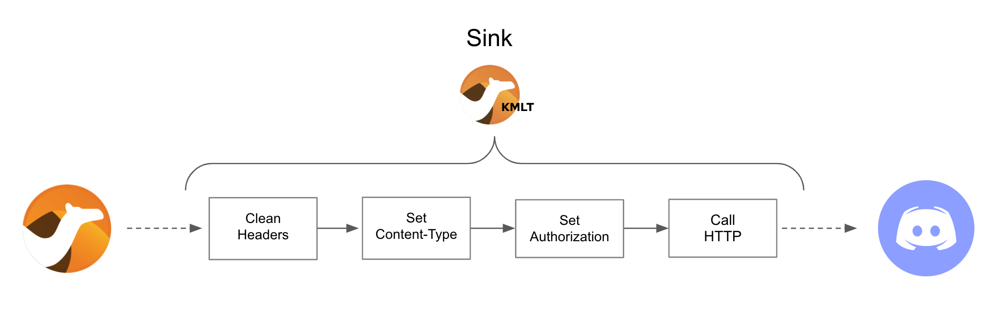

:toc:
:toc-placement!:

= Lab 4 - Discord Integration

toc::[]

== Overview
Up until now we have evolved a solution to interconnect _Gitter_ and _Slack_, and crucially, with the addition of AMQ Streams, now allows for new systems to easily integrate with the platform. In this new Lab we're going to add a new chat option: _Discord_.

_Discord_ is a well known chat platform, very popular among gamers, but more and more embraced by enterprises for internal communications and to connect with their clients.

The difficulty of this new stage is that we don't have in our _Kamelet Catalog_ connecitivity with _Discord_. We need to create our own connectors.

Target persona: +

* *Camel Developer*

Difficulty level: +

* *MEDIUM*

Estimated time: +

* *20 mn*

{empty} +

The picture billow illustrates all chat systems communicating via kafka, including the to-be-integrated Discord system, and optionally (for those willing to go the extra mile) Telegram.

{empty} +

image::images/lab-overview-discord.png[align="center", width=90%]

{empty} +

In terms of implementation effort for this lab, the main tasks to complete are the following:

- Create a Discord Sink Kamelet
- Craete a Kafka to Discord flow using the new Kamelet
- Create a Discord to Kafka flow using Camel K (DSL)

and optionally:

- Create a Telegram to Kafka flow
- Create a Kafka to Teletram flow

{empty} +

== Access Discord's chat platform

Please follow the link below to complete the Discord onboarding process. The guide will describe step by step the setup process. When done, you will be able to continue with the normal flow of the lab.

* link:onboarding-discord.adoc[Discord's platform onboarding]

{empty} +

== Create the Sink Kamelet

TIP: _Kamelets_ are [underline big]_**Camel**_ route snipp[underline big]**ets**. +
A Kamelet encapsulates a normal _Camel_ route.

Our Kamelet definition consists in defining a Camel route that targets _Discord_ as the endpoint.

To integrate with _Discord_ we need to understand well its API, but don't worry, we got you covered. For reference, here's Discord's documentation on how to post messages:

* https://discord.com/developers/docs/resources/channel#create-message

{empty} +

=== Process overview

The diagram below illustrates the processing flow (Camel route) you're about to create:

* There are 4 key processing steps necessary:
+
====
Clean Headers::
    The incoming Camel exchange might have headers that can potentially enter in conflict with the HTTP call to Discord.
Set Content-Type::
	Include an HTTP header to specify the type of payload we send (JSON)
Set Authorization::
	Include an HTTP header with the security token
HTTP invokation::
    Trigger the HTTP call using the Camel HTTP component
====

{empty} +
