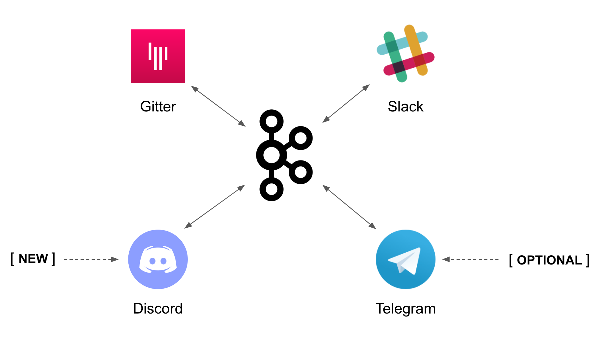

:toc:
:toc-placement!:

= Lab 4 - Discord Integration

toc::[]

== Overview
Up until now we have evolved a solution to interconnect _Gitter_ and _Slack_, and crucially, with the addition of AMQ Streams, now allows for new systems to easily integrate with the platform. In this new Lab we're going to add a new chat option: _Discord_.

_Discord_ is a well known chat platform, very popular among gamers, but more and more embraced by enterprises for internal communications and to connect with their clients.

The difficulty of this new stage is that we don't have in our _Kamelet Catalog_ connecitivity with _Discord_. We need to create our own connectors.

Target persona: +

* *Camel Developer*

Difficulty level: +

* *MEDIUM*

Estimated time: +

* *20 mn*


{empty} +


The picture billow illustrates all chat systems communicating via kafka, including the to-be-integrated Discord system, and optionally (for those willing to go the extra mile) Telegram.



{empty} +

In terms of implementation effort for this lab, the main tasks to complete are the following:

- Create a Discord Sink Kamelet
- Craete a Kafka to Discord flow using the new Kamelet
- Create a Discord to Kafka flow using Camel K (DSL)

and optionally:

- Create a Telegram to Kafka flow
- Create a Kafka to Teletram flow

{empty} +


== [[discord-onboarding]] Access Discord's chat platform

Please follow the link below to complete the Discord onboarding process. The guide will describe step by step the setup process. When done, you will be able to continue with the normal flow of the lab.

* link:onboarding-discord.adoc[Discord's platform onboarding]

{empty} +

== Create the Sink Kamelet

TIP: _Kamelets_ are [underline big]_**Camel**_ route snipp[underline big]**ets**. +
A Kamelet encapsulates a normal _Camel_ route.

Our Kamelet definition consists in defining a Camel route that targets _Discord_ as the endpoint.

To integrate with _Discord_ we need to understand well its API, but don't worry, we got you covered. For reference, here's Discord's documentation on how to post messages:

* https://discord.com/developers/docs/resources/channel#create-message

{empty} +

=== Process overview

The diagram below illustrates the processing flow (Camel route) you're about to create:

image::images/processing-flow-sink.png[align="center", width=90%]


* There are 4 key processing steps necessary:
+
====
Clean Headers::
    The incoming Camel exchange might have headers that can potentially enter in conflict with the HTTP call to Discord.
Set Content-Type::
	Include an HTTP header to specify the type of payload we send (JSON)
Set Authorization::
	Include an HTTP header with the security token
HTTP invokation::
    Trigger the HTTP call using the Camel HTTP component
====

{empty} +

Obviously, developing this process is the task of an experienced Camel developer. When the Kamelet is fully implemented, the Camel developer can place it along the rest of _Kamelets_ in the catalogue, that would allow non-Camel users (the _Kubernetes_ user) to consume it inside _Kamelet Bindings_.

{empty} +

=== Process definition

The best approach to make rapid progress developing this Kamelet, is to use Camel JBang in your local environment.

image::../stage1/images/camel-jbang.png[align="left", width=40%]

{empty} +

==== Prototype the Camel route

The first step is to create a little prototype that will validate our _Camel_ route implementation.

. Setup your lab folder
.. Create your working folder:
+
```bash
mkdir lab4
cd lab4
```
+
.. Create a configuration file
+
```bash
touch stage4.properties
```
+
Include your _Discord_ details:
+
```properties
# Discord credentials
token=YOUR_TOKEN
channel=YOUR_ROOM_ID
```
+
Ensure you configure with your _Discord_ values, and save changes.
+
token::
* If you're sharing an App with the group, use the App's token your admin has provided.
* If you created your own App, use your App's Bot token.
+
channel::
You can find the channel id in the address bar of your Discord browser tab. The pattern is:
* http://discord.com/channels/SERVER_ID/CHANNEL_ID
+

+
{empty} +

. Create a skeleton using Camel JBang in YAML format:
+
For example:
+
```bash
camel init test-discord.yaml
```

. Open and Edit the `test-discord.yaml` file
+
Replace the parameter:
+
--
* `period: "1000"`
--
+
By the parameter `repeatCount` (copy/replace from the snippet below):
+
----
# camel-k: language=yaml

# Write your routes here, for example:
- from:
    uri: "timer:yaml"
    parameters:
----
+
```yaml
      repeatCount: "1"
```
+
----
    steps:
      - setBody:
          constant: "Hello Camel from yaml"
      - log: "${body}"
----

. Run your test route with:
+
```bash
camel run test-discord.yaml --reload \
--properties=stage4.properties
```
+
The output in your terminal should show, once, the following: `Hello Camel from yaml`.
+
{empty} +

. Simulate a _Discord_ payload
+
Let's modify the code to simulate the JSON payload _Discord_ expects. Replace the body with the following:
+
```yaml
      - setBody:
          constant: '{"content": "Hello from Camel"}'
```
+
Save changes. +
_Camel JBang_ will react: it will run the new definition on the fly.
+
{empty} +

. Post to _Discord_
+
Modify the code to call _Discord_'s API to post a message. +
Include the following snipped in your YAML file:
+
----
# camel-k: language=yaml

# Write your routes here, for example:
- from:
    uri: "timer:yaml"
    parameters:
      repeatCount: "1"
    steps:
      - setBody:
          constant: '{"content": "Hello from Camel"}'
      - log: "${body}"
----
+
```yaml
      - remove-headers:
          pattern: "*"
      - set-header:
          name: Content-Type
          simple: application/json
      - set-header:
          name: Authorization
          simple: Bot {{token}}
      - to:
          uri: "https://discordapp.com/api/channels/{{channel}}/messages"
```
+
Save changes. +
Camel JBang will react: it will run the new definition on the fly.
+
If all goes well, Discord will receive the message and display it in the room, as shown below:
+


{empty} +

==== Encapsulate as a Sink

Now that our prototype is fully functional, let's encapsulate the code as a Kamalet Sink.