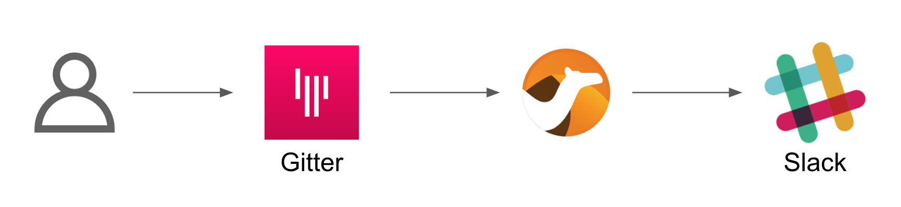
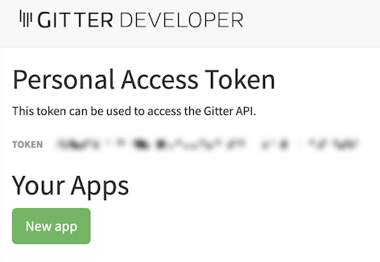
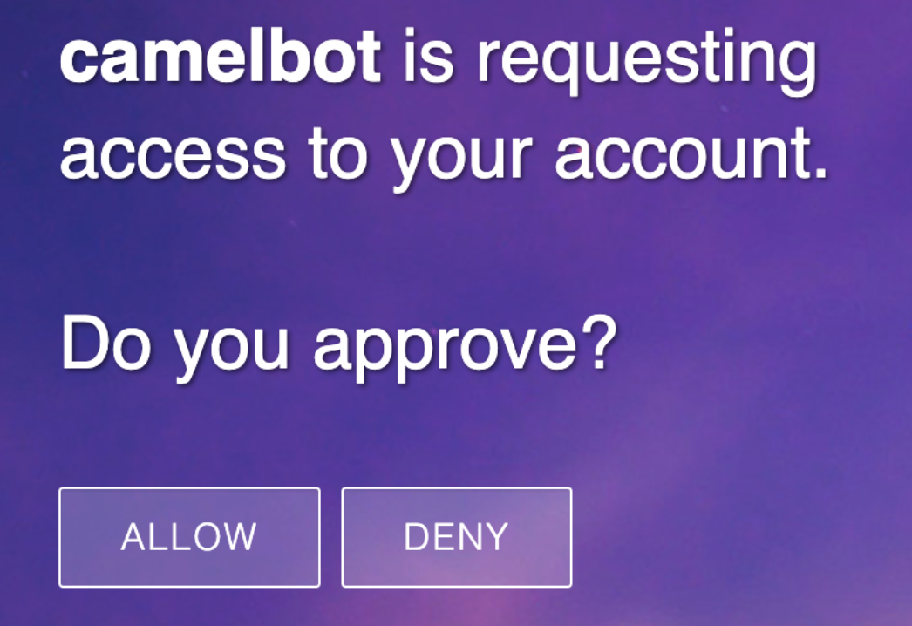

:walkthrough: Gitter to Slack bridge

ifdef::env-github[]
endif::[]

[id='git-slack-bridge']
= Lab 1 - Gitter to Slack bridge

This first stage is all about completing our first integration flow using a Kamelet Binding.

++++
<p>Click on the button to copy the text from the text field. Try to paste the text (e.g. ctrl+v) afterwards in a different window, to see the effect.</p>

<input type="text" value="Hello World" id="myInput">
<!--button onclick="myFunction()">Copy text</button-->
<button onclick="var copyText = document.getElementById('myInput').select();navigator.clipboard.writeText(copyText.value);">copy text</button>
++++

*Overview*
This first stage is all about completing our first integration flow using a Kamelet Binding.

Target persona: +

* *Kubernetes User*

Difficulty level: +

* *EASY*

Estimated time: +

* *20 mn*


There is no previous Camel experience required. +
The picture billow illustrates the data flow traversing our Camel instance:



The above process bridges chat messages from Gitter to Slack. It requires to enable access to both chat platforms.

The tasks to complete in this lab will guide you on how to onboard to both chat systems..

{empty} +

[time=5]
[id="gitter-chat"]
== Gitter's platform onboarding

TIP: If you're unfamiliar with Gitter, it is an open-source chat platform designed for developers to have a space where to discuss project topics.

{empty} +

=== Create an App in Gitter.

. Login in Gitter
+
You can use one of the following accounts to join Gitter:
+
--
* GitHub
* GitLab
* Twitter
--
+
{empty} +
+
Login to Gitter's developer portal following the URL below: + 
https://developer.gitter.im/login
+
Once logged in, you'll be presented with your personal access token and an empty list of apps (if never created one before).
+

+
Create a new App that will communicate with Gitter:

1. Click `Your Apps -> New app`
+
1. Give it a new name and set `\http://localhost:8080` as `Redirect URL`. +
For example:
+
--
* *Name*: +
`camelbot`
* *Redirect URL*: +
`\http://localhost:8080`
--
+
{empty} +
+
Gitter will generate your App's access credentials, for example:
+
image::images/gitter-dev-new-app.png[align="left", width=40%,border-color="green", border-width="3"]
+
{empty} +

=== Authorise your App.

. We need to complete the OAuth web authentication flow.
+
[NOTE]
--
For reference, here's the specification describing the authentication flow:

* https://www.rfc-editor.org/rfc/rfc6749#section-4.1 
--
+
.. Compose the following URL call:
+
CAUTION: ensure you replace `YOUR_APP_OAUTH_KEY`
+
```http
https://gitter.im/login/oauth/authorize?client_id=YOUR_APP_OAUTH_KEY&response_type=code&redirect_uri=http://localhost:8080
```
+
{empty} +
+
For example:
+
* `\https://gitter.im/login/oauth/authorize?client_id=4b03ca9d94d128f1a219027b776722059cc89bba&response_type=code&redirect_uri=http://localhost:8080`
+
{empty} +

.. Open a browser tab, enter your URL in the address bar and press enter. The browser will load an authorization page as per the picture below:
+

+
{empty} +
+
Click `ALLOW`.
+
The approval action will trigger a redirect that will cause a browser connection error since we we're not running a listening app on 8080, but it allows us to obtain the returned authorisation code from the address bar that should be similar to the following:
+
- \http://localhost:8080/?code=`0119b1eb4d69eb1c2bcf3c9a0570a711cd4b038b`
+
{empty} +

.. Take note of the code, now we have to exchange it to obtain an access token. +
Use the following cURL base command:
+
CAUTION: ensure you replace `YOUR_APP_OAUTH_KEY` / `YOUR_APP_OAUTH_SECRET` / `YOUR_REDIRECT_CODE`
+
```curl
CLIENT_ID=YOUR_APP_OAUTH_KEY \
CLIENT_SECRET=YOUR_APP_OAUTH_SECRET \
CODE=YOUR_REDIRECT_CODE \
&& \
curl -v https://gitter.im/login/oauth/token \
-H "accept: application/json" \
-d "client_id="$CLIENT_ID"&client_secret="$CLIENT_SECRET"&redirect_uri=http://localhost:8080&grant_type=authorization_code&code="$CODE
```
+
{empty} +
+
For example:
+
```curl
CLIENT_ID=4b03ca9d94d128f1a219027b776722059cc89bba \
CLIENT_SECRET=8306c0803f4c15319ed20e436870515b8660bad4 \
CODE=0119b1eb4d69eb1c2bcf3c9a0570a711cd4b038b \
&& \
curl -v https://gitter.im/login/oauth/token \
-H "accept: application/json" \
-d "client_id="$CLIENT_ID"&client_secret="$CLIENT_SECRET"&redirect_uri=http://localhost:8080&grant_type=authorization_code&code="$CODE
```
+
{empty} +
+
This above cURL command should return something like:
+
```json
{"access_token":"2d482bdf092e0e2299832b1f38d9560243083894","token_type":"Bearer"}
```
+
{empty} +

.. Now, use the returned token to obtain the Room IDs available using the following base command:
+
CAUTION: ensure you replace `YOUR_ACCESS_TOKEN`
+
```curl
TOKEN=YOUR_ACCESS_TOKEN \
&& \
curl -v https://api.gitter.im/v1/rooms \
-H "Accept: application/json" \
-H "Authorization: Bearer "$TOKEN
```
+
{empty} +
+
For example:
+
```curl
TOKEN=2d482bdf092e0e2299832b1f38d9560243083894 \
&& \
curl -v https://api.gitter.im/v1/rooms \
-H "Accept: application/json" \
-H "Authorization: Bearer "$TOKEN
```
+
{empty} +
+
The command above will probably return an empty list if you have not yet joined any _Gitter_ room.

{empty} +

=== Join a Gitter room.

. A number of public rooms were made available for this workshop (roomX). Choose a room number that nobody uses to avoid noisy conversations. Use the invite URL below to join the lab room:
+
CAUTION: ensure you replace `YOUR_ROOM`
+
```http
https://gitter.im/test-lab-camel/YOUR_ROOM?utm_source=share-link&utm_medium=link&utm_campaign=share-link
```
+
{empty} +
+
For example, if choosing `room1`, use the following invite URL
+
```http
https://gitter.im/test-lab-camel/room1?utm_source=share-link&utm_medium=link&utm_campaign=share-link
```
+
{empty} +
+
Click `JOIN ROOM` at the bottom of the chat room. At this point you see your avatar included in the room on the right hand side of the room.
+
Running the cURL command again to obtain the rooms should return the identifier of the room you just joined, something similar to:
+
```json
[{"id":"6317569e6da03739849c519a"         }]
```
+
{empty} +
+
At this stage, you should have available all the configuration identifiers to define the Kamelet Binding in the next section using the following:
+
```properties
# Gitter credentials
gitter.token=YOUR_ACCESS_TOKEN
gitter.room=YOUR_ROOM_ID
```
+
{empty} +
+
For example
+
```properties
# Gitter credentials
gitter.token=2d482bdf092e0e2299832b1f38d9560243083894
gitter.room=6317569e6da03739849c519a
```

{empty} +

[type=verification]
Did you complete the onboarding successfully?

{empty} +


[time=5]
[id="slack-chat"]
== Slack's platform onboarding


=== Join a Slack workspace.

To accelerate the onboarding process in Slack, we've created a public workspace for anyone to freely join and use for the purpose of this enablement workshop. 

Follow the invite link to join the workshop's workspace in Slack:

* https://join.slack.com/t/camelworkshop/shared_invite/zt-1fvfhatch-HQKSJyob_YIY3nRGhJ7tWA
+
{empty} +
+
CAUTION: The workspace is open to the public, please be mindful of your actions, don't abuse the space.
+
NOTE: if you were unsuccessful joining the public workspace provided, feel free to create you own Slack workspace, you should be able to complete the workshop in the same manner.

{empty} +


=== Join a Slack room (channel).
. A number of public rooms were made available in the public workspace for the workshop (room1, room2, ...roomX). Choose a room number that nobody uses to avoid noisy conversations.
+
Alternatively, you can also create your own room, use the prefix `room_`, for example:

* `room_x`

{empty} +

=== Connecting Camel to Slack

To connect from Camel to the chat platform, an App needs to be registered in Slack. You would just need to add the registered App to a particular room to allow Camel to pick up messages.

* If you are running the workshop on your own, you'll have to create an App in Slack. Click the link below to follow instructions on how to create your own App.

** link:#creating-your-own-app-for-slack[Creating your own App for Slack]

* If you're part of a workshop group, an App has been made available for all students to share. You can skip the next section and directly jump to the section with instructions to add the shared App to your selected room.

** link:#adding-an-app-to-a-room[Adding an App to a room]

{empty} +


==== [[creating-your-own-app-for-slack]] Creating your own App for Slack

. Connect to the following URL
+
* https://api.slack.com/apps

. Click on the `Create New App` button
+
image::images/slack-create-app.png[align="left", width=20%]
+
Select `From scratch`, then
+
.. Give it a name, for example `MyCamelApp`.
.. Select `CamelWorkshop` (or your own workspace if you created one)
.. Click `Create App`
+
Once the App created you'll be presented with its `Basic Information`

. Select from the left menu:
+

* Features => OAuth & Permissions

+
.. Add scopes
+
Scroll down the screen to find the section `Scopes`. +
Include the following Bot scopes:
+
--
- channels:history
- channels:read
- chat:write
- mpim:history
--
+
.. Generate tokens
+
Scroll up until you find `OAuth Tokens for Your Workspace`. +
Click `Install in Workspace`.
+
You will be requested permissions to access the workspace, click `Allow`.
+
Slack then generates and presents the Oauth token for your App:
+
image::images/slack-app-oauth-token.png[align="left", width=80%]

{empty} +

Once your App is created, you're ready to add it to your workspace room (or channel). +
Follow the instructions below on how to add your app:

{empty} +


==== [[adding-an-app-to-a-room]]Adding an App to a room

Once you have an App available, follow the steps below:

. Join a Slack room (channel)
+
A number of public rooms were made available for this workshop (roomX). Choose a room number that nobody uses to avoid noisy conversations.
+
You can also create your own room, use the prefix `room_`, for example:

* `room_x`

. Open the channel details of the room you joined
+
image::images/slack-room-details.png[align="left", width=20%]

. Click on the `Integrations` tab, and add an App
+
image::images/slack-add-app.png[align="left", width=50%]

. Find the `CamelWorkshopApp` (or your own app), and click `Add`
+


Your room has now the App included. Camel can use the App credentials to communicate with Slack.

If you are sharing the App with a group, ask your workshop's admin for the App credentials to configure Camel.


{empty} +

[type=verification]
Did you complete the onboarding successfully?

{empty} +

[time=5]
[id="flow]
== Create the integration flow

=== Process overview

The diagram below illustrates the processing flow you're about to create:

image::images/processing-flow.png[align="center", width=80%]


* There are 3 Kamelets in use:
+

A source
consumes events from Gitter
An action
	transforms Gitter events to Slack events (in JSON format)
A sink
	produces events to Slack


{empty} +

=== User profiles

This workshop has been designed to attend two different user profiles:

The Kubernetes user (no previous Camel experience)
The way this user consumes Camel is by selecting catalog Kamelets and creating Kamelet bindings in YAML definitions. The user creates local YAML files and then pushes them to OpenShift. The Camel K operator automates the process of building, creating images and deploying the integrations.

The Camel developer The traditional Camel developer would typically, first, use his local environment for the inner loop development cycle. This strategy allows speeding up the process of prototyping and validating the code. Once the basics covered, it would follow the same deployment flow as the Kubernetes user.

NOTE The YAML definitions are identical for both profiles. Although this first lab is targeted for the Kubernetes User, we also want to introduce how the Camel developer uses development tooling to accelerate the creation process.

It's up to you to choose which user to impersonate. Considering how easy are the instructions to follow, we recommend choosing the Camel developer, which will anyway mimic the Kubernetes user when deploying in OpenShift. However, if time is a constraint then choose the Kubernetes user.

Time to choose, continue as:

* persona-kubernetes-user.adoc
* persona-camel-developer.adoc

[type=verification]
Did you create the flow successfully?


{empty} +
