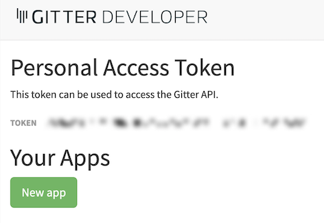
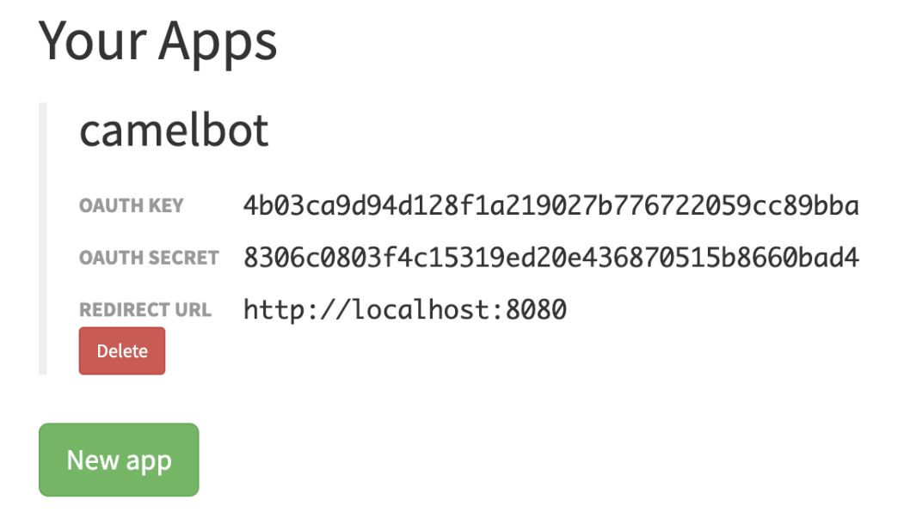

:toc:
:toc-placement!:

toc::[]

== Gitter's platform onboarding

TIP: If you're unfamiliar with Gitter, it is an open-source chat platform designed for developers to have a space where to discuss project topics.

=== Create an App in Gitter.

. Login in Gitter
+
You can use one of the following accounts to join Gitter:
+
--
* GitHub
* GitLab
* Twitter
--
+
Login to Gitter's developer portal following the URL below: + 
https://developer.gitter.im/login
+
Once logged in, you'll be presented with your personal access token and an empty list of apps (if never created one before).
+

+
Create a new App that will communicate with Gitter:

1. Click `Your Apps -> New app`
+
1. Enter a new Name and set `\http://localhost:8080` as `Redirect URL`. For exameple:
+
--
```
Name:
  camelbot

Redirect URL:
  http://localhost:8080
```
Gitter will generate your App's access credentials, for example:


--


=== Authorise your App.

. We need to complete the OAuth web authentication flow.
+
[NOTE]
--
For reference, here's the specification describing the authentication flow:

* https://www.rfc-editor.org/rfc/rfc6749#section-4.1 
--
+
.. Componse the following URL call:

		https://gitter.im/login/oauth/authorize?client_id=YOUR_APP_OAUTH_KEY&response_type=code&redirect_uri=http://localhost:8080
+
For example:

		https://gitter.im/login/oauth/authorize?client_id=4b03ca9d94d128f1a219027b776722059cc89bba&response_type=code&redirect_uri=http://localhost:8080
+

.. Open a browser tab, enter your URL in the address bar and press enter. The browser will load an authorization page as per the picture below:
+
image::images/gitter-dev-new-app-approve.png[align="left", width=30%,border-color="green", border-width="3"]
+
Click `ALLOW`.
+
The approval action will trigger a redirect that will cause a browser connection error since we we're not running a listening app on 8080, but it allows us to obtain the returned authorisation code from the address bar that should be similar to the following:
+
- \http://localhost:8080/?code=`0119b1eb4d69eb1c2bcf3c9a0570a711cd4b038b``
+
.. Take note of the code, now we have to exchange it to obtain an access token. Use the following cURL base command (replace values using your credentials).
+
```curl
CLIENT_ID=YOUR_APP_OAUTH_KEY \
CLIENT_SECRET=YOUR_APP_OAUTH_SECRET \
CODE=YOUR_REDIRECT_CODE \
&& \
curl -v https://gitter.im/login/oauth/token \
-H "accept: application/json" \
-d "client_id="$CLIENT_ID"&client_secret="$CLIENT_SECRET"&redirect_uri=http://localhost:8080&grant_type=authorization_code&code="$CODE
```
+
For example:
+
```curl
CLIENT_ID=4b03ca9d94d128f1a219027b776722059cc89bba \
CLIENT_SECRET=8306c0803f4c15319ed20e436870515b8660bad4 \
CODE=0119b1eb4d69eb1c2bcf3c9a0570a711cd4b038b \
&& \
curl -v https://gitter.im/login/oauth/token \
-H "accept: application/json" \
-d "client_id="$CLIENT_ID"&client_secret="$CLIENT_SECRET"&redirect_uri=http://localhost:8080&grant_type=authorization_code&code="$CODE
```
+
This above cURL command should return something like:
+
```json
{"access_token":"2d482bdf092e0e2299832b1f38d9560243083894","token_type":"Bearer"}
```
+
.. Now, use the returned token to obtain the Room IDs available using the following base command:
+
```curl
TOKEN=YOUR_ACCESS_TOKEN \
&& \
curl -v https://api.gitter.im/v1/rooms \
-H "Accept: application/json" \
-H "Authorization: Bearer "$TOKEN
```
+
For example:
+
```curl
TOKEN=2d482bdf092e0e2299832b1f38d9560243083894 \
&& \
curl -v https://api.gitter.im/v1/rooms \
-H "Accept: application/json" \
-H "Authorization: Bearer "$TOKEN
```
+
The command above will probably return an empty list if you have not yet joined any Gitter room.

=== Join a Gitter room.
. A number of public rooms were made available for this workshop (roomX). Choose a room number that nobody uses to avoid noisy conversations. Replace `YOUR_ROOM` in the following invite URL to join the lab room:

		https://gitter.im/test-lab-camel/YOUR_ROOM?utm_source=share-link&utm_medium=link&utm_campaign=share-link
+
For example, if choosing `room1`, use the following invite URL

		https://gitter.im/test-lab-camel/room1?utm_source=share-link&utm_medium=link&utm_campaign=share-link
+
Click `JOIN ROOM` at the bottom of the chat room. At this point you see your avatar included in the room on the right hand side of the room.
+
Running the cURL command again to obtain the rooms should return the identifier of the room you just joined, something similar to:
+
```json
[{"id":"6317569e6da03739849c519a"         }]
```
+
At this stage, you should have available all the configuration identifiers to define the Kamelet Binding in the next section using the following:
+
```properties
# Gitter credentials
gitter.token=YOUR_ACCESS_TOKEN
gitter.room=YOUR_ROOM_ID
```
+
For example
+
```properties
# Gitter credentials
gitter.token=2d482bdf092e0e2299832b1f38d9560243083894
gitter.room=6317569e6da03739849c519a
```

{empty} +

== Return to the main walkthrough guide

You are now ready to create your integration definition. +
Click the link below to jump back to the main guide walktrough:

* link:walkthrough.adoc#create-the-integration-flow[Create Stage 1 integration flow]

