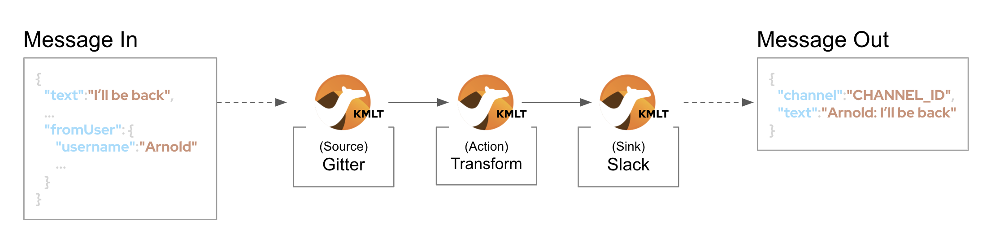

:walkthrough: Gitter to Slack bridge

[id='git-slack-bridge']
= Lab 1 - Gitter to Slack bridge

This first stage is all about completing our first integration flow using a Kamelet Binding.

*Overview*
This first stage is all about completing our first integration flow using a Kamelet Binding.

Target persona: +

* *Kubernetes User*

Difficulty level: +

* *EASY*

Estimated time: +

* *20 mn*

There is no previous Camel experience required. +
The picture billow illustrates the data flow traversing our Camel instance:

// image::images/processing-flow.png[title="Data flow",align="center",title-align=center, width=80%]
image::images/data-flow.png[align="center", width=80%]

The above process bridges chat messages from Gitter to Slack. It requires to enable access to both chat platforms.

For now, follow the onboarding instructions below for Gitter. That will allow us to start with the first integration steps. Later in the walkthrough we will complete the Slack onboarding process.

[time=2]
[id="gitter-chat"]
== Access Gitter's chat platform

// TIP: If you're unfamiliar with Gitter, it is an open-source chat platform designed for developers to have a space where to discuss project topics.

Please follow the link below to complete the Gitter onboarding process. The guide will describe step by step the setup process. When done, you will be able to start constructing the integration flow.

* link:onboarding-gitter.adoc[Gitter's platform onboarding]

{empty} +

[time=5]
[id="flow]
== Create the integration flow

=== Process overview

The diagram below illustrates the processing flow you're about to create:

* There are 3 Kamelets in use:
+

A source
consumes events from Gitter
An action
	transforms Gitter events to Slack events (in JSON format)
A sink
	produces events to Slack

{empty} +

=== User profiles

This workshop has been designed to attend two different user profiles:

The Kubernetes user (no previous Camel experience)::
The way this user consumes Camel is by selecting catalog Kamelets and creating Kamelet bindings in YAML definitions. The user creates local YAML files and then pushes them to OpenShift. The Camel K operator automates the process of building, creating images and deploying the integrations.

The Camel developer:: The traditional Camel developer would typically, first, use his local environment for the inner loop development cycle. This strategy allows speeding up the process of prototyping and validating the code. Once the basics covered, it would follow the same deployment flow as the Kubernetes user.

NOTE: The YAML definitions are identical for both profiles. Although this first lab is targeted for the Kubernetes User, we also want to introduce how the Camel developer uses development tooling to accelerate the creation process.

It's up to you to choose which user to impersonate. Considering how easy are the instructions to follow, we recommend choosing the Camel developer, which will anyway mimic the Kubernetes user when deploying in OpenShift. However, if time is a constraint then choose the Kubernetes user.

Time to choose, continue as:

* link:persona-kubernetes-user.adoc#kubernetes-user[The Kubernetes user]
* link:persona-camel-developer.adoc#camel-developer[The Camel developer]

{empty} +
