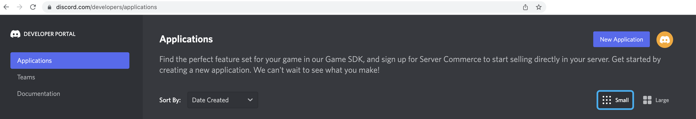

:walkthrough: Discord Integration

ifdef::env-github[]
endif::[]

[id='lab4-discord-integration']
= Lab 4 - Discord Integration

Use Camel K to integrate additional chat systems to the platform. 
// toc::[]

// == Overview
Up until now we have evolved a solution to interconnect _Gitter_ and _Slack_, and crucially, with the addition of AMQ Streams, now allows for new systems to easily integrate with the platform. In this new Lab we're going to add a new chat option: _Discord_.

_Discord_ is a well known chat platform, very popular among gamers, but more and more embraced by enterprises for internal communications and to connect with their clients.

The difficulty of this new stage is that we don't have in our _Kamelet Catalog_ connecitivity with _Discord_. We need to create our own connectors.

{empty} +

Target persona: +

* *Camel Developer*

{empty} +

Difficulty level: +

* *MEDIUM*

{empty} +

Estimated time: +

* *20 mn*

{empty} +

The picture billow illustrates all chat systems communicating via kafka, including the to-be-integrated Discord system, and optionally (for those willing to go the extra mile) Telegram.

image::images/stage-overview-discord.png[align="center", width=90%]

{empty} +

In terms of implementation effort for this lab, the main tasks to complete are the following:

- Create a Discord Sink Kamelet
- Craete a Kafka to Discord flow using the new Kamelet
- Create a Discord to Kafka flow using Camel K (DSL)

and optionally:

- Create a Telegram to Kafka flow
- Create a Kafka to Teletram flow

{empty} +


// == Access Discord\'s chat platform


== Discord\'s platform onboarding

TIP: If you're unfamiliar with _Discord_, it is a well known chat platform, very popular among gamers, but more and more embraced by enterprises for internal communications and to connect with their clients.


[NOTE]
--
If you have never used _Discord_ before, register by using your email address, nothing else is needed.

* https://discord.com/register
--

{empty} +

=== Join a Discord server.

To accelerate the onboarding process in _Discord_, we've created a shared server for anyone to freely join and use for the purpose of this enablement workshop. 

Follow the invite link to join the workshop's server in _Discord_:

* https://discord.gg/4PyTjzjJJz

CAUTION: The server is open to the public, please be mindful of your actions, don't abuse the space.

[NOTE]
--
if you were unsuccessful joining the shared server provided, feel free to create you own _Discord_ server, you should be able to complete the workshop in the same manner.

To create your own server:

. Click the `+` button (add a server).
. select `Create My Own`.
. Then select `For me and my friends` (private server). 
--
{empty} +


=== Join a Discord room (channel).
. A number of rooms have been made available in the shared server for the workshop (room1, room2, ...roomX). Choose a room number that nobody uses to avoid noisy conversations.
+
Alternatively, you can also create your own room (channel), use the prefix `room_`, for example:

* `room_x`

{empty} +

// === [[back-connect-camel-to-discord]]Connecting Camel to Discord
=== Connecting Camel to Discord

To connect from _Camel_ to the chat platform, an App needs to be registered in _Discord_. Apps in _Discord_ are automatically member of all channels in the server.

* If you are running the workshop on your own, you'll have to create an App in _Discord_. Click the link below to follow instructions on how to create your own App.

** link:#creating-your-own-app-for-discord[Creating your own App for Discord]

* If you're part of a workshop group, an App has been made available for all students to share. Ask your workshop's admin to share the App's credentials with you.
+
You can skip the next section (app creation) and directly jump to the end of this task.

** link:#completion-checks[Skip and go to end of task]


// * If you are running your own workshop you'll have to create an App in _Discord_. Click the link below to follow instructions on how to create your own App.

// ** link:#creating-your-own-app-for-discord[Creating your own App for Discord]

// * If you're part of a workshop group, an App has been made available for all students to share. Ask your workshop's admin to share the App's credentials with you.

{empty} +


// === Connect Camel to Slack

// To connect from Camel to the chat platform, an App needs to be registered in Slack. You would just need to add the registered App to a particular room to allow Camel to pick up messages.

// * If you are running the workshop on your own, you'll have to create an App in Slack. Click the link below to follow instructions on how to create your own App.

// ** link:#creating-your-own-app-for-slack[Creating your own App for Slack]

// * If you're part of a workshop group, an App has been made available for all students to share. You can skip the next section and directly jump to the section with instructions to add the shared App to your selected room.

// ** link:#adding-an-app-to-a-room[Adding an App to a room]

// {empty} +


// ==== Return to the main walkthrough guide

// You are now ready to complete your integration definition. +
// Click the link below to jump back to the main guide walktrough:

// * link:walkthrough.adoc#discord-onboarding[Back to the main Stage 4 instructions]

// {empty} +

==== [[creating-your-own-app-for-discord]]Creating your own App for Discord
// ==== Creating your own App for Discord

. Connect to the following URL
+
--
* https://discord.com/developers
+
If you have never used _Discord_ before, register by using your email address, nothing else is needed.
--
+
{empty} +

. Create an App
+
Once in, you'll see your applications dashboard with an empty list of apps (if never created one before).
+

+
.. Click the `New Application` button
+
image::images/discord-create-app.png[align="left", width=20%]
+
.. Give it a name, for example `MyCamelApp`. +
Click `Create`
+
Once the App created you'll be presented with its `General Information`
+
.. Add bot
+
Select from the left menu:
+
--
* SETTINGS => Bot => Add Bot
+
Click `Yes, do it!`
--
+
.. Reset token
+
Discord only shows the Bot token once, make sure you keep note of it.
+
Click `Reset Token`. +
Then, click `Yes, do it!`
+
The new token will be shown on screen as follows:
+

+
Copy and keep it safe, you'll need it when configuring Camel.

{empty} +

. Grant permissions 
+
Select from the left menu:
+
* SETTINGS => OAuth2 => URL Generator
+
.. From `SCOPES` select:
+
--
- bot
--
+
This action will reveal `BOT PERMISSIONS`

.. From `BOT PERMISSIONS` select:
+
--
- GENERAL PERMISSIONS -> Read Messages / View Channels
- TEXT PERMISSIONS -> Send Messages
--
+
Selecting the permissions above shapes a generated URL presented below. +
Scroll down to see the gerented URL, it should look as follows:
+
image::images/discord-app-generated-url.png[align="left", width=100%]
+
Click `Copy`
+
{empty} +

. Authorize your App
+
Open a new tab in your browser and paste the generated URL in the address bar.
+
The browser will load an authorization page. +
Select the Discord server you have previously created. +
Then click `Continue`.
+
You then are presented with a summary of bot permissions to authorize, as per the picture below:
+
image::images/discord-app-auth.png[align="left", width=30%]
+
click `Authorize`. +
Tick `I'm a human`.
+
When the authorization process is done you can close the tab.

{empty} +

Your App should now be visible as a member of the server, with offline status.

In Discord, Apps that are member of a server, automatically become members of all the server channels (rooms).

Click the link below to jump back (scroll up) where you left it:

* link:#back-connect-camel-to-discord[Connecting Camel to _Discord_]

{empty} +
{empty} +

==== [[completion-checks]] End of task

You completed the task !

=== Completion checks

[type=verification]
Do you have an App already available in Discord?

[type=verification]
Do you have the App's credentials to configure Camel?


{empty} +

== Part 1 - Create the Sink Kamelet

TIP: _Kamelets_ are [underline big]_**Camel**_ route snipp[underline big]**ets**. +
A Kamelet encapsulates a normal _Camel_ route.

Our Kamelet definition consists in defining a Camel route that targets _Discord_ as the endpoint.

To integrate with _Discord_ we need to understand well its API, but don't worry, we got you covered. For reference, here's Discord's documentation on how to post messages:

* https://discord.com/developers/docs/resources/channel#create-message

{empty} +

=== Process overview

The diagram below illustrates the processing flow (Camel route) you're about to create:

image::images/processing-flow-sink.png[align="center", width=90%]


There are 4 key processing steps necessary:

====
* *Clean Headers* +
  The incoming Camel exchange might have headers that can potentially enter in conflict with the HTTP call to Discord.

* *Set Content-Type* +
	Include an HTTP header to specify the type of payload we send (JSON)

* *Set Authorization* +
	Include an HTTP header with the security token

* *HTTP invokation* +
  Trigger the HTTP call using the Camel HTTP component
====

{empty} +

Obviously, developing this process is the task of an experienced Camel developer. When the Kamelet is fully implemented, the Camel developer can place it along the rest of _Kamelets_ in the catalogue, that would allow non-Camel users (the _Kubernetes_ user) to consume it inside _Kamelet Bindings_.

{empty} +

=== Process definition

The best approach to make rapid progress developing this Kamelet, is to use Camel JBang in your local environment.

image::images/camel-jbang.png[align="left", width=40%]

{empty} +

==== Prototype the Camel route

The first step is to create a little prototype that will validate our _Camel_ route implementation.

. Setup your lab folder
.. Create your working folder:
+
```bash
mkdir lab4
cd lab4
```
+
{empty} +
+
.. Create a configuration file
+
```bash
touch stage4.properties
```
+
Include your _Discord_ details:
+
```properties
# Discord credentials
token=YOUR_TOKEN
channel=YOUR_ROOM_ID
```
+
--

{empty} +

Ensure you configure with your _Discord_ values, and save changes.

- `token`
* If you're sharing an App with the group, use the App's token your admin has provided.
* If you created your own App, use your App's Bot token.

- `channel` +
You can find the channel id in the address bar of your Discord browser tab. The pattern is:
+
* http://discord.com/channels/SERVER_ID/CHANNEL_ID
+
image::images/discord-room-id.png[align="left", width=100%]
--
+
{empty} +

. Create a skeleton using Camel JBang in YAML format:
+
For example:
+
```bash
camel init test-discord.yaml
```

. Open and Edit the `test-discord.yaml` file
+
Replace the parameter:
+
--
* `period: "1000"`
--
+
By the parameter `repeatCount` (copy/replace from the snippet below):
+
----
# camel-k: language=yaml

# Write your routes here, for example:
- from:
    uri: "timer:yaml"
    parameters:
----
+
```yaml
      repeatCount: "1"
```
+
----
    steps:
      - setBody:
          constant: "Hello Camel from yaml"
      - log: "${body}"
----
+
{empty} +

. Run your test route with:
+
```bash
camel run * --reload
```
+
The output in your terminal should show, once, the following: `Hello Camel from yaml`.
+
{empty} +

. Simulate a _Discord_ payload
+
Let's modify the code to simulate the JSON payload _Discord_ expects. Replace the body with the following:
+
```yaml
      - setBody:
          constant: '{"content": "Hello from Camel"}'
```
+
Save changes. +
_Camel JBang_ will react: it will load the new definition on the fly and run it.
+
{empty} +

. Post to _Discord_
+
Modify the code to call _Discord_'s API to post a message. +
Include the following snipped in your YAML file:
+
----
# camel-k: language=yaml

# Write your routes here, for example:
- from:
    uri: "timer:yaml"
    parameters:
      repeatCount: "1"
    steps:
      - setBody:
          constant: '{"content": "Hello from Camel"}'
      - log: "${body}"
----
+
```yaml
      - remove-headers:
          pattern: "*"
      - set-header:
          name: Content-Type
          simple: application/json
      - set-header:
          name: Authorization
          simple: Bot {{token}}
      - to:
          uri: "https://discordapp.com/api/channels/{{channel}}/messages"
```
+
{empty} +
+
Save changes. +
_Camel JBang_ will react: it will load the new definition on the fly and run it.
+
If all goes well, Discord will receive the message and display it in the room, as shown below:
+

+
The first goal has been accomplished. image:images/emoji-clap.png[width=3%]
+
Press `ctrl`+`c` to stop _Camel JBang_.
+
{empty} +

==== Encapsulate as a Sink

Now that our prototype is fully functional, let's encapsulate the code as a Kamalet Sink.

. Create skeleton
+
Use the following command to create a Kamelet skeleton:
+
```bash
camel init discord-sink.kamelet.yaml
```
+
Open the file in your editor.
+
{empty} +

. Define your Kamelet
+
.. define its type as _Sink_
+
----
apiVersion: camel.apache.org/v1alpha1
kind: Kamelet
metadata:
  name: discord-sink
  labels:
----
+
```yaml
    camel.apache.org/kamelet.type: "sink"
```
+
.. define metadata and parameters
+
```yaml
spec:
  definition:
    title: "Discord Sink"
    description: |-
      Send messages to Discord.
    required:
      - token
      - room
    type: object
    properties:
      token:
        title: Security Token
        description: The bot security token
        type: string
      channelid:
        title: Channel Identifier
        description: The channel id
        type: string
  types:
    out:
      mediaType: application/json
  dependencies:
  - "camel:kamelet"
  template:
    from:
      uri: "kamelet:source"
      steps:
```
+
.. include your prototype code
+
```yaml
      - remove-headers:
          pattern: "*"
      - set-header:
          name: Content-Type
          simple: application/json
      - set-header:
          name: Authorization
          simple: Bot {{token}}
      - to:
          uri: "https://discordapp.com/api/channels/{{channel}}/messages"
```
+ 
{empty} +

. Test your Kamelet
+
.. Modify your prototype `test-discord.yaml`
+
Replace the HTTP logic by your Kamelet:  
+
----
# camel-k: language=yaml

# Write your routes here, for example:
- from:
    uri: "timer:yaml"
    parameters:
      repeatCount: "1"
    steps:
      - setBody:
          constant: '{"content": "Hello from Camel"}'
      - log: "${body}"
----
+
```yaml
      - to:
          uri: "kamelet:discord-sink"
          parameters:
            token:   "{{token}}"
            channel: "{{channel}}"
```
+
Save changes.
+
{empty} +
+
.. Run it
+
```bash
camel run *
```
+
Again, if all goes well, Discord will receive the message and display it in the room, as shown below:
+

+
The second goal has been accomplished. image:images/emoji-clap.png[width=3%]
+
Press `ctrl`+`c` to stop _Camel JBang_.
+
{empty} +

== Part 2 - Kafka ⇒ Discord

We have now the building block we were missing, we can now bind our _Discord_ _Kamelet_ to Kafka to push chat conversations to Discord.

=== Process overview

You should by now be very familiar with the necessary processing steps. The diagram below illustrates the _Kafka_ to _Discord_ data flow:

image::images/processing-flow-kafka2discord.png[align="center", width=90%]

There are 4 Kamelets in use:

====
* *A source* +
Consumes events from Kafka.

* *Two actions* +
One filters messages to prevent death loops. +
One transforms events from the standard data model to _Discord_.

* *A sink* +
Produces events to _Discord_.
====

{empty} +


=== Process definition

. Setup the Kamelet Binding
+
Given the process is almost identical to the Kafka to Gitter/Slack ones, we can use one of those as a base for our definition.
+
Run the following commands in your terminal:
+
```bash
cp ../lab3/flows/k2s.yaml k2d.yaml
sed -i '' 's/k2s/k2d/g'       k2d.yaml
sed -i '' 's/slack/discord/g' k2d.yaml
sed -i '' 's/stage3/stage4/g' k2d.yaml
touch k2d.jslt
```
+
{empty} +
+
[NOTE]
====
The commands above changed the `k2d.yaml` binding with the following amendments:

* Its name is `k2d` (Kafka to Discord)
* The filter blocks `discord` source events
* Applies the `k2d.jslt` transformation (to be defined)
* Uses the new _Discord Sink Kamelet_
====
+
No extra changes are required on the _Kamelet Binding_, it's good to go.
+
{empty} +


. Define the JSLT transformation (Standard -> Discord).
+
Copy the snippet below and paste it into your new `k2d.jslt` file:
+
```
{
	"content":"**"+.user+"@"+.source+"**: "+.text
}
```
+
{empty} +
+
[NOTE]
====
We're mapping values from the Standard data model
====
{empty} +

And that's it, ready to be deployed.

{empty} +