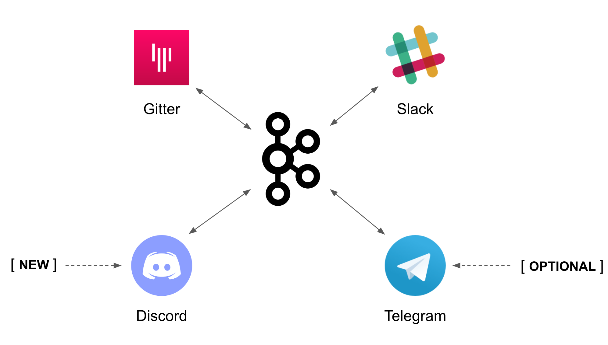

:walkthrough: Discord Integration
:checkedbox: pass:normal[{startsb}&#10004;{endsb}]

ifdef::env-github[]
endif::[]

[id='lab4-discord-integration']
= Lab 4 - Discord Integration

Use Camel K to integrate additional chat systems to the platform. 
// toc::[]

// == Overview
Up until now we have evolved a solution to interconnect _Gitter_ and _Slack_, and crucially, with the addition of AMQ Streams, now the platform allows for new systems to easily integrate. In this new Lab we're going to add a new chat option: _Discord_.

_Discord_ is a well known chat platform, very popular among gamers, but increasingly embraced by enterprises to connect internal teams but also for external interactions with customers as a way to maintain close contact.

The difficulty of this new stage is that the catalog does not have _Kamelets_ for _Discord_. We need to create our own connectors.

{empty} +

Target persona: +

* *Camel Developer*

{empty} +

Difficulty level: +

* *MEDIUM*

{empty} +

Estimated time: +

* *20 mn*

{empty} +

The picture billow illustrates all chat systems communicating via _Kafka_, including the to-be-integrated _Discord_ system, and optionally (for those willing to go the extra mile) _Telegram_.



{empty} +

In terms of implementation effort for this lab, the main tasks to complete are the following:

- Create a _Discord_ sink _Kamelet_
- Craete a _Kafka_ -> _Discord_ flow using the new _Kamelet_
- Create a _Discord_ -> _Kafka_ flow using _Camel K_ (DSL)

{empty} +

and optionally:

- Create a _Telegram_ -> _Kafka_ flow
- Create a _Kafka_ -> _Teletram_ flow

{empty} +


// == Access Discord\'s chat platform


[time=5]
[id="discord-chat"]
== Discord\'s platform onboarding

TIP: If you're unfamiliar with _Discord_, it is a well known chat platform, very popular among gamers, but increasingly embraced by enterprises to connect internal teams but also for external interactions with customers as a way to maintain close contact.


[NOTE]
--
If you have never used _Discord_ before, it's easy to register by using your email address (no phone numbers required).

* https://discord.com/register
--

{empty} +

=== Join a Discord server.

To accelerate the onboarding process in _Discord_, we've created a shared server for anyone to freely join and use for the purpose of this enablement workshop. 

Follow the invite link to join the workshop's server in _Discord_:

* https://discord.gg/4PyTjzjJJz

CAUTION: The server is open to the public, please be mindful of your actions, don't abuse the space.

[NOTE]
--
if you were unsuccessful joining the shared server provided, feel free to create you own _Discord_ server, you should be able to complete the workshop in the same manner.

To create your own server:

. Click the `+` button (add a server).
. select `Create My Own`.
. Then select `For me and my friends` (private server). 
--
{empty} +


=== Join a Discord room (channel).
. A number of rooms have been made available in the shared server for the workshop (room1, room2, ...roomX). Choose a room number that nobody uses to avoid noisy conversations.
+
Alternatively, you can also create your own room (channel), use the prefix `room_`, for example:

* `room_x`

{empty} +

=== Connecting Camel to Discord

To connect from _Camel_ to the chat platform, an App needs to be registered in _Discord_. Apps in _Discord_ are automatically member of all channels in the server.

* If you are running the workshop on your own, you'll have to create an App in _Discord_. Click the link below to follow instructions on how to create your own App.

** link:#creating-your-own-app-for-discord[Creating your own App for Discord]

{empty} +

* If you're part of a workshop group, an App has been made available for all students to share. Ask your workshop's admin for the App's credentials to configure your Camel instance.
+
You can skip the next section (app creation) and directly jump to the end of this task.

** link:#completion-checks[Skip and go to end of task]

{empty} +


==== [[creating-your-own-app-for-discord]]Creating your own App for Discord

. Connect to the following URL
+
--
* https://discord.com/developers
+
If you have never used _Discord_ before, register by using your email address (no phone numbers required).
--
+
{empty} +

. Create an App
+
Once in, you'll see your applications dashboard with an empty list of apps (if never created one before).
+
image::images/discord-apps.png[align="left", width=90%,border-color="green", border-width="3"]
+
{empty} +

.. Click the `New Application` button
+

+
{empty} +

.. Give it a name, for example `MyCamelApp`. +
Click `Create`
+
Once the App created you'll be presented with its `General Information`
+
{empty} +

.. Add bot
+
Select from the left menu:
+
--
* SETTINGS => Bot => Add Bot
+
Click `Yes, do it!`
--
+
{empty} +

.. Reset token
+
Discord only shows the Bot token once, make sure you keep note of it.
+
Click `Reset Token`. +
Then, click `Yes, do it!`
+
The new token will be shown on screen as follows:
+
image::images/discord-app-token.png[align="left", width=90%]
+
{empty} +
+
Copy and keep it safe, you'll need it when configuring Camel.

{empty} +

. Grant permissions 
+
Select from the left menu:
+
* SETTINGS => OAuth2 => URL Generator
+
.. From `SCOPES` select:
+
--
{checkedbox} bot
--
+
This action will reveal `BOT PERMISSIONS`
+
{empty} +

.. From `BOT PERMISSIONS` select:
+
--
|===
|GENERAL PERMISSIONS 
|{checkedbox} Read Messages / View Channels
|===
--
+
{empty} +
+
--
|===
|TEXT PERMISSIONS
|{checkedbox} Send Messages
|===
--
+
{empty} +
+
Selecting the permissions above shapes a generated URL presented below. +
Scroll down to see the gerented URL, it should look as follows:
+

+
{empty} +
+
Click `Copy`
+
{empty} +

. Authorize your App
+
Open a new tab in your browser and paste the generated URL in the address bar. +
-> The browser will load an authorization page. +
+
Select from the dropdown list the _Discord_ server you have previously created. +
Then click `Continue`.
+
You then are presented with a summary of bot permissions to authorize, as per the picture below:
+

+
{empty} +
+
click `Authorize`. +
Tick `I'm a human` {checkedbox}
+
When the authorization process is done you can close the tab.

{empty} +

Your App should now be visible as a member of the server, with offline status.


{empty} +

In _Discord_, Apps that are member of a server, automatically become members of all the server channels (rooms).


{empty} +
{empty} +

==== [[completion-checks]] End of task

You completed the task !

=== Completion checks

[type=verification]
Do you have an App available in _Discord_ (your own or shared)?

[type=verification]
Do you have the App's credentials to configure _Camel_?


{empty} +


[time=10]
[id="kamelet-create"]
== Part 1 - Create the Sink Kamelet

TIP: _Kamelets_ are [underline big]_**Camel**_ route snipp[underline big]**ets**. +
A Kamelet encapsulates a normal _Camel_ route.

The _Kamelet_ to create involves defining a Camel route that targets _Discord_ as the endpoint system.

To integrate with _Discord_ we need to understand well its API, but don't worry, we got you covered. For reference, here's _Discord_'s documentation on how to post messages:

* https://discord.com/developers/docs/resources/channel#create-message

{empty} +

=== Process overview

The diagram below illustrates the processing flow (Camel route) you're about to create:

image::images/processing-flow-sink.png[align="center", width=90%]


There are 4 key processing steps necessary:

====
* *Clean Headers* +
  The incoming _Camel_ exchange might have headers that can potentially enter in conflict with the HTTP call to _Discord_.

* *Set Content-Type* +
	Include an HTTP header to specify the type of payload we send (JSON)

* *Set Authorization* +
	Include an HTTP header with the security token

* *HTTP invokation* +
  Trigger the HTTP call using the _Camel_ HTTP component
====

{empty} +

Obviously, developing this process is the task of an experienced _Camel_ developer. When the _Kamelet_ is fully implemented, it gets deployed along the rest of _Kamelets_ in the catalogue, which allows non-_Camel_ users (the _Kubernetes_ user) to consume it inside _Kamelet Bindings_.

{empty} +

=== Process definition

The best approach to make rapid progress developing this _Kamelet_, is to use _Camel JBang_ in your local environment.

image::images/camel-jbang.png[align="left", width=40%]

{empty} +

==== Prototype the Camel route

The first step is to create a little prototype that will validate our _Camel_ route implementation.

. Setup your lab folder
.. Create your working folder:
+
```bash
mkdir lab4
cd lab4
:
```
+
{empty} +
+
.. Create a configuration file
+
```bash
touch stage4.properties
```
+
{empty} +
+
Include your _Discord_ details:
+
```properties
# Discord credentials
token=YOUR_TOKEN
channel=YOUR_ROOM_ID
```
+
--

{empty} +

Ensure you configure with your _Discord_ values, and save changes.

- `token`
* If you're sharing an App with the group, use the App's token your admin has provided.
* If you created your own App, use your App's Bot token.

- `channel` +
You can find the channel id in the address bar of your _Discord_ browser tab. The pattern is:
+
* http://discord.com/channels/SERVER_ID/CHANNEL_ID
+

--
+
{empty} +

. Create a skeleton using _Camel JBang_ in YAML format:
+
For example:
+
```bash
camel init test-discord.yaml
```
+
{empty} +

. Open and Edit the `test-discord.yaml` file
+
Replace the parameter:
+
--
* `period: "1000"`
--
+
{empty} +
+
Use instead the parameter `repeatCount` (copy/replace from the snippet below):
+
----
# camel-k: language=yaml

# Write your routes here, for example:
- from:
    uri: "timer:yaml"
    parameters:
----
+
```yaml
      repeatCount: "1"
```
+
----
    steps:
      - setBody:
          constant: "Hello Camel from yaml"
      - log: "${body}"
----
+
{empty} +

. Run your test route with:
+
```bash
camel run * --reload
```
+
TIP: the flag `reload` indicates to _Camel JBang_ to hot reload new definitions whenever file changes are detected allowing fast prototyping.
+
The output in your terminal should show, only once, the following: `Hello Camel from yaml`.
+
{empty} +

. Simulate a _Discord_ payload
+
Let's modify the code to simulate the JSON payload _Discord_ expects. Replace the body with the following:
+
----
    steps:
      - setBody:
----
+
```yaml
          constant: '{"content": "Hello from Camel"}'
```
+
----
      - log: "${body}"
----
+
{empty} +
+
Save changes. +
-> _Camel JBang_ will react: it will load the new definition on the fly and run it.
+
You should see the following in the log output:
+
----
... {"content": "Hello from Camel"}
----
+ 
{empty} +

. Post to _Discord_
+
Modify the code to call _Discord_'s API to post a message. +
Include the following snipped in your YAML file:
+
----
# camel-k: language=yaml

# Write your routes here, for example:
- from:
    uri: "timer:yaml"
    parameters:
      repeatCount: "1"
    steps:
      - setBody:
          constant: '{"content": "Hello from Camel"}'
      - log: "${body}"
----
+
```yaml
      - remove-headers:
          pattern: "*"
      - set-header:
          name: Content-Type
          simple: application/json
      - set-header:
          name: Authorization
          simple: Bot {{token}}
      - to:
          uri: "https://discordapp.com/api/channels/{{channel}}/messages"
```
+
{empty} +
+
Save changes. +
-> _Camel JBang_ will react: it will load the new definition on the fly and run it.
+
If all goes well, _Discord_ will receive the message and display it in the room, as shown below:
+
image::images/discord-room-hello.png[align="left", width=40%]
+
{empty} +

=== End of prototyping

[type=verification]
Did you see the message showing in _Discord_?

[type=verificationSuccess]
The first goal has been accomplished. image:images/emoji-clap.png[width=3%]

[type=verificationFail]
Verify the snippet copy/paste actions were well followed.

{empty} +

Press `ctrl`+`c` to stop _Camel JBang_.

{empty} +

==== Encapsulate as a Sink

Now that our prototype is fully functional, let's encapsulate the code as a _Kamelet_ sink.

. Create skeleton
+
Use the following command to create a _Kamelet_ skeleton:
+
```bash
camel init discord-sink.kamelet.yaml
```
+
{empty} +
+
Open the file in your editor.
+
{empty} +

. Define your Kamelet
+
.. define its type as `sink`
+
----
apiVersion: camel.apache.org/v1alpha1
kind: Kamelet
metadata:
  name: discord-sink
  labels:
----
+
```yaml
    camel.apache.org/kamelet.type: "sink"
```
+
{empty} +
+
.. define metadata and parameters
+
```yaml
spec:
  definition:
    title: "Discord Sink"
    description: |-
      Send messages to Discord.
    required:
      - token
      - channel
    type: object
    properties:
      token:
        title: Security Token
        description: The bot security token
        type: string
      channel:
        title: Channel Identifier
        description: The channel id
        type: string
  types:
    out:
      mediaType: application/json
  dependencies:
  - "camel:kamelet"
  template:
    from:
      uri: "kamelet:source"
      steps:
```
+
{empty} +
+
.. include your prototype code
+
```yaml
      - remove-headers:
          pattern: "*"
      - set-header:
          name: Content-Type
          simple: application/json
      - set-header:
          name: Authorization
          simple: Bot {{token}}
      - to:
          uri: "https://discordapp.com/api/channels/{{channel}}/messages"
```
+ 
{empty} +

. Test your _Kamelet_
+
.. Modify your prototype `test-discord.yaml`
+
Replace the HTTP logic with your _Kamelet_:  
+
----
# camel-k: language=yaml

# Write your routes here, for example:
- from:
    uri: "timer:yaml"
    parameters:
      repeatCount: "1"
    steps:
      - setBody:
          constant: '{"content": "Hello from Camel"}'
      - log: "${body}"
----
+
```yaml
      - to:
          uri: "kamelet:discord-sink"
          parameters:
            token:   "{{discord.token}}"
            channel: "{{discord.channel}}"
```
+
{empty} +
+
Save changes.
+
{empty} +
.. Update configuration
+
We include a prefix on parameters to avoid confusion with other chat systems.
+
```bash
sed -i '' 's/token/discord.token/g' stage4.properties
sed -i '' 's/channel/discord.channel/g' stage4.properties
:
```
+
{empty} +

.. Run it
+
```bash
camel run *
```
+
{empty} +
+
Again, if all goes well, _Discord_ will receive the message and display it in the room, as shown below:
+
image::images/discord-room-hello.png[align="left", width=40%]
+
{empty} +
+


=== End of encapsulation

[type=verification]
Did you see the message showing in _Discord_?

[type=verificationSuccess]
The second goal has been accomplished. image:images/emoji-clap.png[width=3%]

[type=verificationFail]
Verify the snippet copy/paste actions were well followed.

{empty} +

Press `ctrl`+`c` to stop _Camel JBang_.

{empty} +


[time=5]
[id="kamelet-binding-create"]
== Part 2 - Kafka ⇒ Discord

We have now the building block we were missing, we can now bind our _Discord_ _Kamelet_ to _Kafka_ to push chat conversations to _Discord_.

=== Process overview

You should by now be very familiar with the necessary processing steps. The diagram below illustrates the _Kafka_ to _Discord_ data flow:

image::images/processing-flow-kafka2discord.png[align="center", width=90%]

There are 4 Kamelets in use:

====
* *A source* +
Consumes events from _Kafka_.

* *Two actions* +
One filters messages to prevent death loops. +
One transforms events from the standard data model to _Discord_.

* *A sink* +
Produces events to _Discord_.
====

{empty} +


=== Process definition

. Setup the _Kamelet_ binding
+
Given the process is almost identical to the _Kafka_ to _Gitter_/_Slack_ ones, we can use one of those as a base for our definition.
+
Run the following commands in your terminal:
+
```bash
cp ../lab3/flows/k2s.yaml k2d.yaml
sed -i '' 's/k2s/k2d/g'       k2d.yaml
sed -i '' 's/slack/discord/g' k2d.yaml
sed -i '' 's/stage3/stage4/g' k2d.yaml
touch k2d.jslt
```
+
{empty} +
+
[NOTE]
====
The commands above modified the `k2d.yaml` binding with the following changes:

* Its name is `k2d` (_Kafka_ to _Discord_)
* The filter blocks `discord` source events
* Applies the `k2d.jslt` transformation (to be defined)
* Uses the new _Discord sink Kamelet_
====
+
{empty} +

. Update the sink definition
+
In the previous step we modified the sink from a _Slack_ one to _Discord_. However, while _Slack_ only required a `token`, _Discord_ requires also a `channel`. +
Copy the `channel` parameter from the snipped below in the sink definition of your YAML file:
+
----
  sink:
    ref:
      kind: Kamelet
      apiVersion: camel.apache.org/v1
      name: discord-sink
    properties:
      token: "{{discord.token}}"
----
+
```yaml
      channel: "{{discord.channel}}"
```
+
{empty} +
+
Save changes.
+
{empty} +

. Define the JSLT transformation (Standard -> _Discord_).
+
Copy the snippet below and paste it into your new `k2d.jslt` file:
+
```
{
	"content":"**"+.user+"@"+.source+"**: "+.text
}
```
+
{empty} +
+
[NOTE]
====
We're mapping values from the Standard data model JSON structure
====
{empty} +

And that's it, ready to be deployed.

{empty} +

=== Deploy and test

. Deploy the _Kamelet_
+
To allow _Kubernetes_ users to consume (use in a binding) the _Discord_ _Kamelet_, we need to push the its definition to _OpenShift_ to become part of the Kamelet catalog.
+
Push it using the following command:
+
```bash
oc apply -f discord-sink.kamelet.yaml
```
+
{empty} +


. Push the configuration to _OpenShift_
+
For your _Kamelet_ binding to operate, its configuration needs to be available in _OpenShift_.
+
Create the _Secret_ and the _ConfigMap_ that includes the JSLT. +
Run the following `oc` command:
+
```bash
oc create secret generic stage4 --from-file=stage4.properties
oc create cm stage4-transform --from-file=k2d.jslt
:
```
{empty} +

. Deploy the YAML definition containing your new _Kamelet Binding_
.. Run the following `oc` command to deploy the integration:
+
```bash
oc apply -f k2d.yaml
```
+
NOTE: Be patient, this action will take some time to complete as the operator needs to download all related dependencies, build the applications and create the image before the integration can be deployed.

.. Wait for readyness
+
Check the deployment of the pod and logs to ensure all is in healthy state.
+
You can run the following command to check their state:
+
```bash
oc get klb k2d
```
+
{empty} +
+
When the pods are ready, the command should return:
+
----
NAME   PHASE   REPLICAS
k2d    Ready   1
----
+
{empty} +

. Send messages to test the system.
+
.. Go to you _Gitter_'s room and send a message, for example `Hello from Gitter`.

.. Then go to you _Slack_'s room and send a message, for example `Hello from Slack`.
+
If all goes well you should see something similar to the picture below:
+

+
{empty} +

+
{empty} +

[type=verification]
Did you see the message going from _Gitter_ to _Discord_?

[type=verificationSuccess]
Very good !

[type=verificationFail]
Inspect in the pod logs to troubleshoot.


[type=verification]
Did you see the message going from _Slack_ to _Discord_?

[type=verificationSuccess]
Very good !

[type=verificationFail]
Inspect in the pod logs to troubleshoot.


[time=5]
[id="kamelet-binding-create"]
== Part 3 - Discord ⇒ Kafka

gdfgdjfgljdgfium
