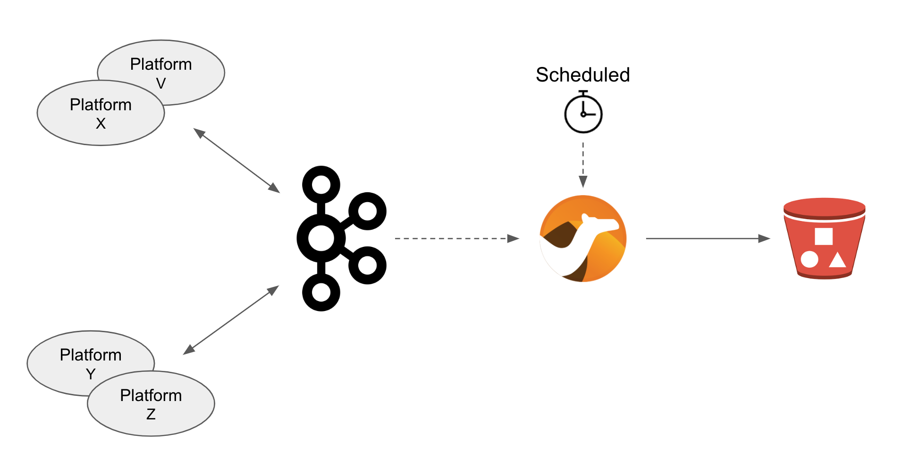
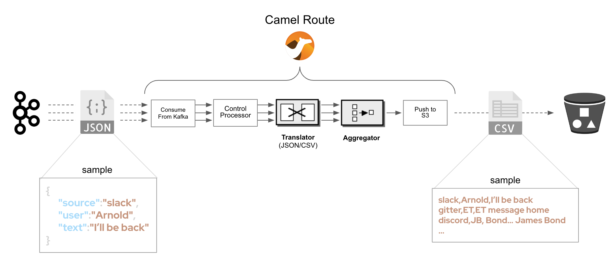
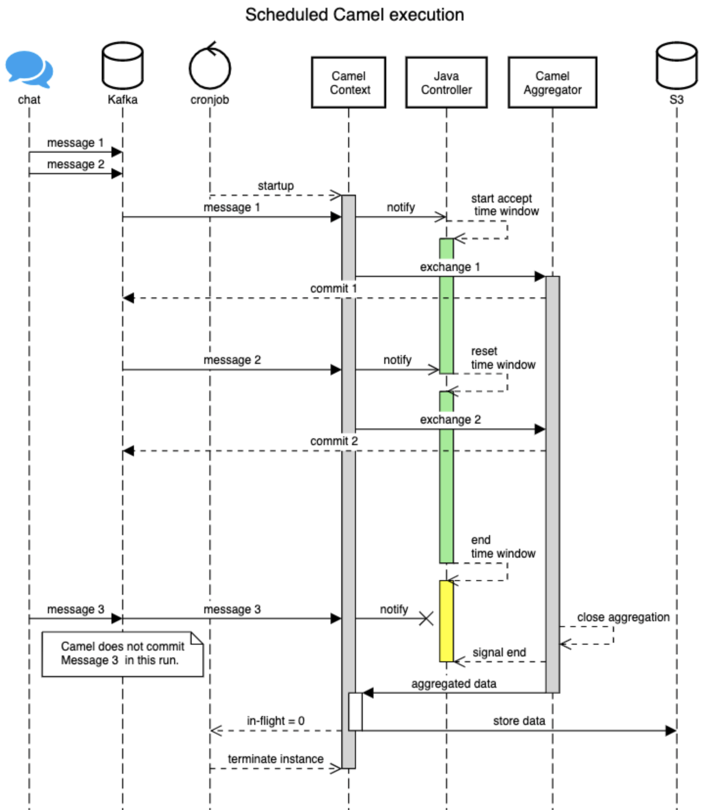

:walkthrough: Storage

ifdef::env-github[]
endif::[]

[id='lab5-storage']
// = Lab 5 - Storage
= Lab 5 - Add Storage to the Architecture

Use OpenShift Data Foundation to provide storage capabilities and services to the MessageHub platform.

All the lab stages you have completed so far have focussed on interconnecting independent instant messaging platforms. This lab however simulates the need to respond to government regulations (or policies alike) to meet legal and business data archival requirements.

Adding _Kafka_ in the architecture was a strategical decision. Any type of message broker would have been qualified, except we chose _Kafka_ because of its ability to replay data streams.

In the context explained, the plan is to process data streams from room conversations and transfer them to a storage layer dedicated to meet the data retention requirements.

In the diagram above we see a number of instant messaging platforms interacting together via _Kafka_. The depicted _Camel_ process represents the new integration to develop responsible to replay streams and push conversations to the storage system.

The clock in the diagram illustrates an on/off mechanism described as follows: the _OpenShift_ platform starts up the new _Camel_ process at scheduled intervals, for example once a day, to process and archive daily conversations. Once the job done, the platform shutdowns the _Camel_ process until the next scheduled run.

{empty} +

Target persona: +
--
* *Camel Developer* +
{empty} +
--
Difficulty level: +
--
* *MEDIUM/ADVANCED* +
{empty} +
--
Estimated time: +
--
* *10 mn* +
{empty} +
--

[time=5]
[id="daily-storage"]
== Understand the storage process

The process to implement is not a trivial one, it requires to perform a series of well coordinated actions. To start with, the scheduler mechanism is based on _Kubernetes_ cronjobs, which _Camel K_ leverages and that we can take advantage of.

_Camel K_ includes the concept of _'Traits'_. These are capabilities that can be enabled/disabled or configured to customise the behaviour of the final integration. The `Cron` trait allows us to program scheduled runs of the integration, _OpenShift_ will automatically fire off an instance that will start processing _Kafka_ events. When the end of the data stream is reached, the process shuts down.

{empty} +

=== Process overview

The diagram below describes the _Camel_ process to be implemented. This integration involves multiple EIPs (_Enterprise Integration Patterns_) and therefore belongs to the _Camel_ developer who will use the _Camel DSL_ to define it.

There are 5 main steps involved:

====
* *A Kafka consumer* +
Consumes events from _Kafka_.

* *A custom controller* +
Java process responsible to coordinate the aggregator with the cronjob to accurately control the start/end of the data stream processing. +

* *A data transformer* +
Formats JSON messages into CSV entries in preparation for the aggregation action. +

* *An aggregator* +
Merges all the incoming messages into a single body that contains all the CSV entries of a daily digest of a chat room. +

* *An S3 producer* +
Uploads the daily digest into an S3 bucket.
====

{empty} +

=== The custom controller

One tricky scenario we must handle with care is how to prevent the cronjob from killing the _Camel_ instance too early. Let's explain it in more detail.

The cronjob knows when to kill a running instance once _Camel_ reports the number of _Exchanges_ in-flight (still executing) is nil.

NOTE: An `_Exchange_` is the Java object _Camel_ creates encapsulating the incoming message (and its context). It traverses the _Camel_ route (processing steps) from start to finish, at which point the exchange is disposed.

While an in-flight exchange walks the _Camel_ route from start to finish, the _Aggregator EIP_ creates and keeps a copy that is merged with other preceding and following exchanges. When all exchanges reach the end of transit, the _Camel_ instance informs the cronjob no live (in-flight) exchanges are in execution, however, the aggregator EIP may still be waiting for more exchanges to digest. What this all means is that the cronjob might kill the _Camel_ instance before the aggregation had time to be completed.

The controller, implemented as a Java class and integrated with _Camel_, will help to prevent the cronjob from shutting down _Camel_ too early. 

{empty} +

==== End of stream

Another consideration to have in mind is how to determine the end (in the current run) of the data stream. As far as the _Kafka_ consumer is concerned, it will keep creating _Camel_ exchanges as long as _Kafka_ messages are available, the listener is always active. As developers, we need to decide where the cut off point will be.

The adopted strategy in this lab (surely other strategies are possible) is to define a windowed time interval, inside which messages are accepted, and consider late arrivals as discarded. Meanwhile, our aggregator can operate in a similar time window and, when reaching its time limit, close the collection and push the aggregated data to storage.

{empty} +

==== Sequence diagram

To best understand all that was described above, look at the sequence diagram below depicting all the interactions between the different entities involved. 

{empty} +

{empty} +

[NOTE] 
--
Pay special attention to the following diagram highlights:

* For every incoming event, _Camel_ notifies the controller.
* The time window (in green) for accepting messages (to aggregate) starts when the controller gets its first notification.
* Subsequent notifications (new messages) reset the time window.
* All aggregated messages are committed to _Kafka_.
* When the time window closes (in yellow), late arrivals (like Message 3) are ignored.
* Non committed (in this run) events are reprocessed on subsequent cronjob runs.
* The controller ensures the `in-flight=0` is only reported when the aggregator completes and the data is pushed to storage. 
--

{empty} +